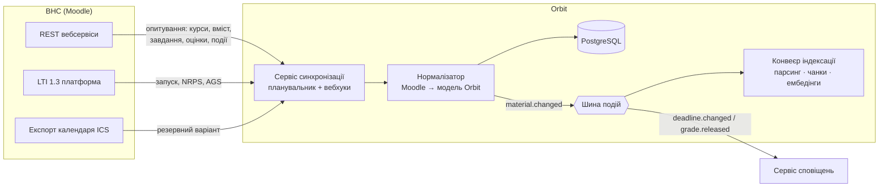
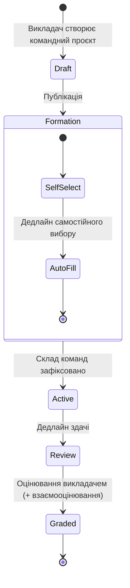
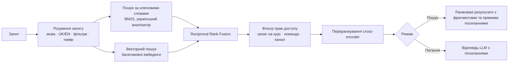
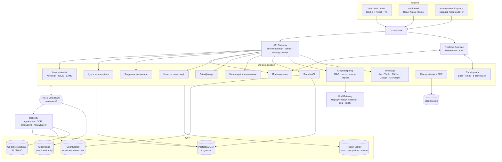
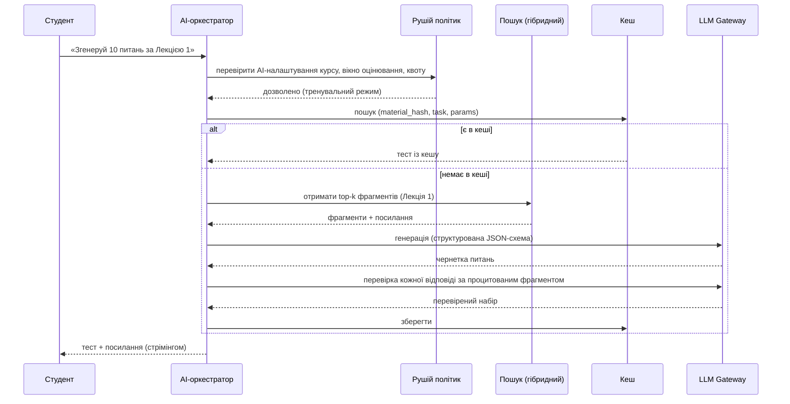
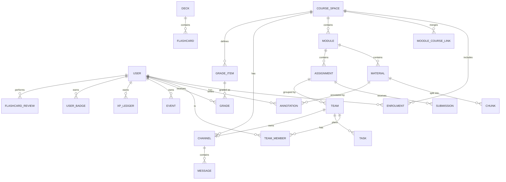

# Orbit: навчальна платформа нового покоління

> **Робоча назва:** Orbit
> **Тип:** Продуктова та технічна специфікація (концепт → MVP)
> **Базова система:** ВНС Львівської політехніки (`vns.lpnu.ua`, LMS на базі Moodle)
> **Автор:** Ярослав Шевчук
> **Дата:** 22 вересня 2026
> **Статус:** Чернетка v0.1

---

## Зміст

1. [Резюме](#1-резюме)
2. [Аудит поточної платформи](#2-аудит-поточної-платформи)
3. [Бачення продукту, принципи та персони](#3-бачення-продукту-принципи-та-персони)
4. [Стратегія інтеграції: розширення ВНС без заміни](#4-стратегія-інтеграції-розширення-внс-без-заміни)
5. [Функціональні модулі](#5-функціональні-модулі)
   - 5.1 [Комунікаційний хаб](#51-комунікаційний-хаб)
   - 5.2 [Групи та командні проєкти](#52-групи-та-командні-проєкти)
   - 5.3 [AI-помічник для навчання](#53-ai-помічник-для-навчання)
   - 5.4 [Уніфікований пошук (RAG + ключові слова)](#54-уніфікований-пошук-rag--ключові-слова)
   - 5.5 [Нотатки та анотації (викладач + студент)](#55-нотатки-та-анотації-викладач--студент)
   - 5.6 [Гейміфікація та винагороди](#56-гейміфікація-та-винагороди)
   - 5.7 [Відстеження прогресу та планування](#57-відстеження-прогресу-та-планування)
   - 5.8 [Оновлений дизайн](#58-оновлений-дизайн)
6. [Архітектура системи](#6-архітектура-системи)
7. [Модель даних](#7-модель-даних)
8. [Дизайн API](#8-дизайн-api)
9. [Цілі продуктивності та надійності](#9-цілі-продуктивності-та-надійності)
10. [Безпека, приватність та академічна доброчесність](#10-безпека-приватність-та-академічна-доброчесність)
11. [Тарифи, преміум-функції та сталість](#11-тарифи-преміум-функції-та-сталість)
12. [Дорожня карта](#12-дорожня-карта)
13. [Метрики успіху](#13-метрики-успіху)
14. [Ризики та способи їх зменшення](#14-ризики-та-способи-їх-зменшення)
15. [Додатки](#15-додатки)

---

## 1. Резюме

ВНС добре виконує роль **сховища навчального контенту**: лекції, PDF, завдання, оцінки та календар. Бракує всього, що відбувається *довкола* контенту: спілкування, командної роботи, розуміння матеріалу, мотивації та планування тижня.

**Orbit** — це окремий продукт, що працює поверх наявної ВНС. Він **синхронізує** курси, матеріали, завдання, оцінки та події з Moodle, а потім додає:

| Напрям | Що отримують студенти й викладачі |
|---|---|
| 💬 **Комунікація** | Канали курсів у реальному часі, треди, простори груп, зручний обмін файлами, оголошення |
| 👥 **Командні проєкти** | Формування команд, спільні здачі, відстеження внеску, синхронізація з Jira/Trello/GitHub |
| 🤖 **AI-помічник** | Конспекти, тести та флеш-картки, згенеровані з матеріалів курсу, з посиланнями на джерела |
| 🔎 **Уніфікований пошук** | Гібридний пошук (RAG + ключові слова) по всіх курсах, матеріалах, завданнях і повідомленнях |
| 📝 **Нотатки** | Нотатки викладача (спільні або особисті) та анотації студентів, прив'язані до матеріалів |
| 🏆 **Гейміфікація** | Серії (streaks), XP, бейджі, сезонні челенджі, винагороди, що відкривають бонуси |
| 📈 **Прогрес і планування** | Реальний прогноз оцінок, єдиний календар, AI-планувальник дедлайнів |
| ⚡ **Сучасний стек** | Швидкий, mobile-first інтерфейс і бекенд реального часу з p95 затримкою API до 200 мс |

**Ключовий принцип:** Moodle залишається *системою обліку* (system of record) для офіційних оцінок і здач. Orbit — *система залучення* (system of engagement). Це дозволяє запустити Orbit без міграції даних і без вимоги до університету замінювати інфраструктуру.

---

## 2. Аудит поточної платформи

Аудит базується на студентських екранах `vns.lpnu.ua` (обліковий запис студента 2 курсу, вересень 2026).

### 2.1 Що є зараз

| Розділ | Поточний стан (спостереження) | Компонент Moodle |
|---|---|---|
| **Особистий кабінет** (`/my/`) | «Нещодавно переглянуті елементи», «Filtered course list» з групуванням за роками (1 курс / 2 курс), дерево навігації, статичне оголошення «Обслуговування системи», «Зараз на сайті» | `block_recentlyaccesseditems`, `block_filtered_course_list`, `block_navigation`, `block_html`, `block_online_users` |
| **Сторінка курсу** (`/course/view.php`) | Лінійні тематичні розділи: сторінка, PDF-презентація, PDF-шпаргалка, завдання | Формат курсу «Теми» |
| **Сторінка лекції** (`/mod/page/`) | Довгий HTML-план зі списками, ключові теми, без медіа й інтерактивності | `mod_page` |
| **Завдання** (`/mod/assign/`) | Дати початку/завершення, PDF з умовою, кнопка «Здати роботу», таблиця статусу (подання, оцінювання, залишок часу, коментарі) | `mod_assign` |
| **Профіль** | Email, країна, місто, часовий пояс, список курсів, активність входу, QR-код мобільного додатка | Профіль користувача (core) |
| **Огляд оцінок** | Таблиця курсів з одним числом або «-» | `gradereport_overview` |
| **Журнал оцінок курсу** | Елементи з вагами, оцінкою, інтервалом, відсотком, внеском у підсумок | `gradereport_user` |
| **Календар** | Місячна сітка; 1 подія за весь вересень («Строк Лабораторна робота 1»); ручне вікно «Створити подію» з TinyMCE | `core_calendar` |
| **Повідомлення** | Панель: Зірочка (1), Група (0), Приватна (0), «Немає приватних бесід» | `core_message` |

### 2.2 Проблеми та можливості

| # | Спостереження | Чому це важливо | Рішення в Orbit |
|---|---|---|---|
| P1 | **Повідомлення фактично не використовуються.** 0 групових і 0 приватних бесід, хоча онлайн 500+ користувачів. | Студенти переходять у Telegram/Discord, тож комунікація курсу розпорошується й губиться. | Канали курсів у реальному часі, треди, автоматичні простори груп (§5.1) |
| P2 | **Немає інструментів для командної роботи.** Завдання індивідуальні, спільного простору немає. | Групові проєкти відбуваються поза LMS, а внесок учасників невидимий для викладача. | Командні проєкти зі спільною здачею та аналітикою внеску (§5.2) |
| P3 | **Матеріали лекцій — статичний текст або PDF.** | Складно повторювати, немає самоперевірки, немає конспектів. | AI-конспекти, тести та флеш-картки з посиланнями на джерела (§5.3) |
| P4 | **Немає пошуку між курсами.** Щоб знайти «той PDF про CSSOM», треба клікати по розділах. | Втрачений час; матеріали завантажують повторно й гублять. | Гібридний семантичний пошук + пошук за ключовими словами (§5.4) |
| P5 | **Оманливий підсумок курсу.** У «Функційному програмуванні» оцінено 2 з 6 елементів (5/5 + 5/5). Підсумок показує **10,00 / інтервал 0–10 / 100 %**, але реально це **10 зі 100 можливих балів**, попереду Екзамен (0–55) та Лаби 3–5. | Студенти не бачать, де насправді перебувають і що їм потрібно. | Прогноз оцінок: зароблено, максимально досяжно, «потрібно для оцінки X» (§5.7) |
| P6 | **Календар майже порожній.** З'являються лише курси з налаштованими дедлайнами, імпорту з Google чи Outlook немає. | Календар не може слугувати планувальником. | Єдиний календар з імпортом ICS/Google/Outlook та AI-планувальником (§5.7) |
| P7 | **Дублікати курсів.** «Програмування клієнтських систем» відображається двічі (ймовірно, окремі курси лекцій і лабораторних). | Заплутана навігація. | «Простір курсу» (Course Space) об'єднує пов'язані курси Moodle в один вигляд (§4.3) |
| P8 | **Немає контексту від викладача.** Викладач не може додати пояснення біля конкретного слайда чи абзацу. | Питання повторюються, виправлення помилок не оголошуються. | Прив'язані нотатки викладача, спільні або особисті (§5.5) |
| P9 | **Немає мотиваційного циклу.** Ніщо не заохочує регулярне навчання; прогрес видно лише як фінальне число. | Студенти відкладають і зубрять перед дедлайном. | Серії, XP, бейджі та винагороди (§5.6) |
| P10 | **Застарілий інтерфейс.** Щільні таблиці, desktop-first верстка, багато повних перезавантажень сторінок, немає темної теми. | Повільно й втомлює, особливо на телефоні. | Оновлений SPA/PWA з оновленнями в реальному часі (§5.8, §6) |
| P11 | **Статичне оголошення про техроботи** постійно займає місце в кабінеті. | Марнує простір, легко пропустити, коли воно справді важливе. | Банери, які можна закрити, + push-сповіщення |

### 2.3 Сильні сторони, які варто зберегти

- **Структура курсу за темами** (нумеровані розділи з коротким описом) природно лягає на навчальні модулі.
- **Зважений журнал оцінок** уже містить дані, потрібні для прогнозування.
- **Мобільні вебсервіси увімкнені** («Цей сайт має доступ до мобільних додатків»). REST API Moodle доступний, тож інтеграція можлива з першого дня.
- **Інституційна SSO-ідентичність** (облікові записи `@lpnu.ua`) дає надійний рівень ідентифікації.

---

## 3. Бачення продукту, принципи та персони

### 3.1 Бачення

> *Кожен студент університету має одне місце, щоб розуміти матеріал, працювати з одногрупниками й завжди знати, що робити далі.*

### 3.2 Принципи дизайну

1. **Доповнювати, а не замінювати.** Moodle залишається офіційним джерелом, і кожна функція Orbit коректно деградує, якщо синхронізація недоступна.
2. **AI, що спирається на матеріали.** Відповіді AI завжди посилаються на джерело (курс, файл, сторінку чи слайд). Немає джерела — немає відповіді.
3. **Контроль у викладача.** Викладачі вирішують, які AI-функції увімкнені для кожного курсу та кожного оцінювання.
4. **Мотивація без маніпуляцій.** Гейміфікація винагороджує навчальну поведінку, а не час перед екраном. Є «заморозка серії», і система ніколи нікого не присоромлює.
5. **Швидкість за замовчуванням.** Кожен екран стає інтерактивним менш ніж за 1 секунду на телефоні середнього класу через 4G.
6. **Приватність понад усе.** Мінімум даних, явна згода, відповідність GDPR та Закону України «Про захист персональних даних».

### 3.3 Персони

| Персона | Цілі | Що дратує зараз | Ключові функції Orbit |
|---|---|---|---|
| **Студент: Ярослав, 2 курс, КН** | Вчасно здавати лаби, розуміти теорію, ефективно працювати в команді | Розпорошені чати, незрозумілий стан оцінок, статичні PDF | Планувальник, AI-флеш-картки, командні простори, пошук |
| **Студент — лідер команди** | Розподіляти роботу, стежити за командою, здавати один раз за всю групу | Координація в Telegram, невидимий внесок | Командні проєкти, синхронізація з Jira/Trello, звіт про внесок |
| **Викладач** | Подавати матеріал, відповідати на питання один раз, справедливо оцінювати | Повторювані питання, немає уявлення про динаміку груп | Прив'язані нотатки, оголошення, AI-FAQ, аналітика |
| **Асистент викладача** | Модерувати канали, підтримувати лабораторні | Немає інструментів модерації | Ролі, черга модерації, запис на консультації |
| **Адміністратор кафедри** | Впровадження, відповідність вимогам, контроль витрат | Немає даних про залученість | Адмін-консоль, керування AI-квотами, журнали аудиту |

---

## 4. Стратегія інтеграції: розширення ВНС без заміни

### 4.1 Режими інтеграції

| Режим | Як | Коли використовувати | Переваги | Недоліки |
|---|---|---|---|---|
| **A. Персональний токен (пілот)** | Студент входить з обліковими даними ВНС, і Orbit отримує токен з `/login/token.php?service=moodle_mobile_app` — той самий механізм, що й в офіційному мобільному додатку | Пілот і впровадження з ініціативи студентів | Працює вже зараз, дії адміністратора не потрібні | Доступ лише в межах користувача; треба дотримуватись правил користування університету; пароль ніколи не зберігається (лише токен) |
| **B. Інституційний вебсервіс** | Університет створює окремий зовнішній сервіс з обмеженим набором функцій і сервісним обліковим записом | Офіційне впровадження на кафедрі | Повна синхронізація на рівні курсів, функції для викладачів | Потрібне погодження ІТ-служби |
| **C. LTI 1.3 Advantage** | Orbit реєструється як LTI-інструмент. Deep linking, Names & Roles (NRPS) та Assignment & Grade Services (AGS) | Глибоке вбудовування в курси Moodle, передача оцінок назад | Стандартно, безпечно, запуск зсередини ВНС | Складніше налаштування; LTI-запуски прив'язані до окремих активностей |

**Рекомендований шлях:** A для пілоту (1–2 курси, студенти-волонтери), далі B + C для офіційного впровадження.

### 4.2 Архітектура синхронізації



**Частота синхронізації**

| Сутність | Стратегія | Частота |
|---|---|---|
| Курси, на які записаний | Повна синхронізація | При вході, далі кожні 6 год |
| Вміст курсу (розділи, модулі, файли) | Інкрементальна (порівняння `timemodified`) | Кожні 30 хв; за запитом при відкритті курсу |
| Завдання та статус подання | Інкрементальна | Кожні 15 хв; кожні 5 хв протягом 48 год до дедлайну |
| Оцінки | Інкрементальна | Кожні 30 хв |
| Події календаря | Запит за часовим вікном (−7 д … +120 д) | Кожні 30 хв |
| Файли | Дедуплікація за хешем вмісту (`contenthash`); завантаження лише при зміні | Разом із синхронізацією вмісту |

Moodle не надсилає події самостійно. Orbit ефективно опитує API, а в режимі B може використати легкий **локальний плагін** Moodle (`local_orbit_events`), який пересилає події зі спостерігачів Moodle (`\mod_assign\event\submission_graded`, `\core\event\course_module_updated`) на вебхук Orbit.

### 4.3 Відповідність понять

| Moodle | Orbit | Примітки |
|---|---|---|
| Курс | **Простір курсу (Course Space)** | Один простір може об'єднувати кілька курсів Moodle (наприклад, продубльовані курси лекцій і лабораторних «Програмування клієнтських систем») |
| Розділ (тема) | **Модуль** | Зберігає нумерацію та опис |
| `mod_page`, `mod_resource` (PDF), `mod_url` | **Матеріал** | Розпарсений, проіндексований, з анотаціями та AI |
| `mod_assign` | **Завдання** | Індивідуальне або **командне** (на рівні Orbit). Фінальна здача записується назад у Moodle |
| `mod_quiz` | **Офіційний тест** | Лише посилання; AI-тести Orbit окремі й чітко позначені як тренувальні |
| Групи / групування Moodle | **Групи та команди** | Імпортуються й розширюються в Orbit |
| Елементи журналу оцінок | **Елементи оцінювання** + прогноз | Ваги й інтервали зберігаються для точного прогнозу |
| Події календаря | **Події** | Об'єднуються із зовнішніми календарями |
| Повідомлення | **Канали / приватні повідомлення** | Опційний двосторонній міст для приватних повідомлень |

### 4.4 Правила зворотного запису

| Дія в Orbit | Записується в Moodle? | Як |
|---|---|---|
| Здати завдання (індивідуальне) | ✅ | `core_files_upload` / `webservice/upload.php` → `mod_assign_save_submission` → `mod_assign_submit_for_grading` |
| Здати командне завдання | ✅ | Здається від кожного учасника або через групову здачу Moodle, якщо в завданні увімкнено `teamsubmission` |
| Створити особисту подію в календарі | ✅ (опційно) | `core_calendar_create_calendar_events` (тип `user`) |
| Результат AI-тесту | ❌ | Залишається в Orbit (лише тренування) |
| Оцінка викладача через Orbit | ✅ (режим C) | Публікація оцінки через LTI AGS |

---

## 5. Функціональні модулі

### 5.1 Комунікаційний хаб

**Мета:** перенести комунікацію курсу *всередину* навчального контексту, щоб вона залишалася доступною для пошуку та пов'язаною з матеріалами й дедлайнами.

#### 5.1.1 Структура

```
Простір курсу: Програмування клієнтських систем
├── 📢 #оголошення          (пише лише викладач; студенти реагують і питають у тредах)
├── 💬 #загальне
├── ❓ #питання-відповіді    (режим Q&A: прийняті відповіді, AI-підказки про дублікати)
├── 📚 #модуль-1-веб-архітектура    (створюється автоматично для кожного розділу Moodle)
├── 📚 #модуль-2-фронтенд-бекенд-iot
├── 🧪 #лаба-1              (створюється автоматично для кожного завдання; архівується через 14 днів після дедлайну)
├── 👥 Групи
│   ├── КН-21 (академічна група, імпортована)
│   └── Підгрупа A / B (поділ на лабораторні)
└── 🛠 Команди
    ├── Команда «Pixel» (проєктна команда, приватна)
    └── Команда «Byte»
```

#### 5.1.2 Функції

| Функція | Деталі | Пріоритет |
|---|---|---|
| Канали в реальному часі | Доставка через WebSocket, індикатор набору тексту, присутність, статус прочитання | MVP |
| Треди | Відповідь у треді, підписка/відписка, короткий підсумок треду | MVP |
| Приватні та групові повідомлення | 1:1 і до 20 учасників, опційне наскрізне шифрування для приватних | MVP |
| Згадки | `@user`, `@team`, `@group`, `@lecturer`, `@channel` (з обмеженням частоти) | MVP |
| Розширений контент | Markdown, блоки коду з підсвіткою синтаксису, LaTeX (`$...$`), Mermaid, галереї зображень | MVP |
| Картки матеріалів | Вставлене посилання на ВНС/Orbit розгортається в картку (назва, модуль, дедлайн, «відкрити на сторінці 5») | MVP |
| Обмін файлами | Перетягування, попередній перегляд (PDF, зображення, код, Office через конвертацію), версіонування, квота сховища на простір | MVP |
| Режим Q&A | Позначення прийнятих відповідей, голосування, відповіді, схвалені викладачем, підказки «схоже питання вже мало відповідь» (семантично) | v1 |
| Оголошення | Відкладені публікації, обов'язкове підтвердження («✅ Прочитано»), розсилка через push і email | MVP |
| AI-дайджест тредів | «Що я пропустив»: підсумок непрочитаного по каналах з посиланнями | v1 |
| Опитування | Один/кілька варіантів, анонімний режим, дедлайн | v1 |
| Консультації | Викладач публікує слоти; студенти записуються; автоматично створюється посилання на дзвінок і подія в календарі | v1 |
| Голосові/відеокімнати | Кімнати WebRTC (LiveKit/Jitsi) для команд, демонстрація екрана | v2 |
| Модерація | Скарга на повідомлення, повільний режим, фільтри слів, роль модератора для асистента, журнал аудиту | MVP |
| Мости | Опційний міст у Telegram/Discord для оголошень (в один бік) | v2 |

#### 5.1.3 Поділ на групи

- **Автоматичний імпорт** академічних груп і груп Moodle.
- **Інструмент поділу** для викладачів: поділ курсу чи групи на N підгруп
  - випадково,
  - за алфавітом,
  - за вибором студентів (студенти обирають слот; діють ліміти місткості),
  - з балансуванням навичок (на основі опційної самооцінки чи попередніх оцінок, за згодою),
  - з урахуванням сумісності розкладів (з імпортованих календарів, лише зайнятість/вільний час).
- Кожна підгрупа автоматично отримує канал, файловий простір і видимість у календарі.
- **Запити на обмін:** студент може попросити обмінятися місцем; викладач підтверджує, або обмін затверджується автоматично, якщо він взаємний.

#### 5.1.4 Розширений обмін інформацією

- **Бібліотека простору:** кураторський репозиторій з тегами для кожного курсу (матеріали викладача плюс схвалені внески студентів: конспекти, шпаргалки, корисні посилання).
- **Процес внеску студентів:** студент пропонує ресурс, асистент або викладач схвалює його, і ресурс публікується із зазначенням автора та приносить бейдж «Контриб'ютор».
- **Закріплені знання:** закріплення повідомлень і файлів у каналі; AI перетворює часто закріплені питання-відповіді на FAQ курсу.
- **Перевірка битих посилань:** зовнішні посилання перевіряються щотижня й позначаються, якщо не працюють.

---

### 5.2 Групи та командні проєкти

**Мета:** повноцінна підтримка групових проєктів — від формування команди до єдиної фінальної здачі — зі справедливим і видимим внеском.

#### 5.2.1 Життєвий цикл



*Стани: Draft — чернетка, Formation — формування команд, Active — робота, Review — перевірка, Graded — оцінено; SelfSelect — самостійний вибір, AutoFill — автоматичне доукомплектування.*

#### 5.2.2 Формування команд

| Метод | Опис |
|---|---|
| Самостійний вибір | Студенти створюють команди або приєднуються до них (мін./макс. розмір контролюється) |
| Коди запрошення | Лідер команди ділиться кодом або посиланням |
| Призначення викладачем | Ручна дошка з перетягуванням |
| Автоматичне доукомплектування | Нерозподілені студенти розподіляються до дедлайну з балансуванням розміру, підгрупи та (опційно) навичок |
| Вибір тем | Викладач публікує теми; команди ранжують їх; розподіл методом стабільного паросполучення |

#### 5.2.3 Робочий простір команди

Кожна команда отримує:

- **Приватний канал** + голосову кімнату
- **Спільні файли** з версіонуванням
- **Дошку завдань** (вбудований Kanban: Зробити / В роботі / На перевірці / Готово) **або** прив'язану дошку Jira/Trello/GitHub Projects
- **Етапи (milestones)**, визначені з умови проєкту (задані викладачем або запропоновані AI і схвалені викладачем)
- **Шаблон протоколу зустрічі** з AI-підсумком і виокремленням задач
- **Зону здачі:** одна здача на команду, записується назад у Moodle

#### 5.2.4 Інтеграції з таск-трекерами

| Інструмент | Інтеграція | Синхронізація |
|---|---|---|
| **Trello** | OAuth; прив'язка дошки до команди; відповідність списків статусам | Двостороння: картки ↔ задачі Orbit (назва, виконавець, дедлайн, чек-лист) через вебхуки |
| **Jira Cloud** | OAuth 2.0 (3LO); прив'язка проєкту; відповідність статусів задач | Двостороння для задач/підзадач; вигляд спринтів |
| **GitHub** | GitHub App; прив'язка репозиторію | Issues/PR як задачі; коміти й PR враховуються у внеску; попередній перегляд README |
| **GitLab** | OAuth; аналогічно GitHub | v2 |
| **Вбудований** | Власний Kanban для команд, що не використовують зовнішні інструменти | — |

**AI-розподіл роботи:** лідер команди вставляє умову завдання або посилання на неї, і AI пропонує:

1. структуру декомпозиції робіт (епіки → задачі з оцінками),
2. графік, що вкладається в дедлайн і враховує імпортовані календарі учасників,
3. збалансований розподіл за заявленими навичками.

Лідер редагує та приймає пропозицію, після чого задачі створюються в Orbit, Trello або Jira.

#### 5.2.5 Внесок і справедливість

- **Панель внеску** (бачать команда й викладач): виконані задачі, коміти/PR (якщо підключено GitHub), створені файли, відвідування зустрічей, результати взаємооцінювання.
- **Взаємооцінювання:** налаштовувана рубрика (наприклад, надійність, якість, комунікація); відповіді анонімні для одногрупників і видимі для викладача. Підтримує коригування балів у стилі WebPA.
- **Раннє попередження:** сповіщає викладача (ніколи публічно), якщо учасник неактивний 7+ днів перед етапом.
- **Прозорість:** метрики внеску слугують основою для розмови. Вони ніколи не виставляють оцінку автоматично.

---

### 5.3 AI-помічник для навчання

**Мета:** допомогти студентам *розуміти й запам'ятовувати* матеріал курсу, спираючись виключно на цей матеріал.

#### 5.3.1 Можливості

| Можливість | Вхід | Результат | Приклад (з поточного курсу) |
|---|---|---|---|
| **Конспект** | Матеріал, модуль або весь курс | TL;DR, ключові поняття, структурований план, глосарій | «Зроби конспект *1. Вступ та еволюція Веб-архітектури* у 10 пунктах» |
| **Пояснення** | Виділений текст, слайд, термін | Пояснення простою мовою з прикладом і посиланням на джерело | Виділити «Critical Rendering Path» → покроково DOM → CSSOM → Render Tree → Layout → Paint → Composite |
| **Генератор тестів** | Матеріал(и), складність, типи питань | Один варіант, кілька варіантів, так/ні, коротка відповідь, читання коду, впорядкування | «10 питань про HTTP-методи та коди статусу, середня складність» |
| **Флеш-картки** | Матеріал(и) або виділення | Картки питання/відповідь і з пропусками, з інтервальним повторенням (FSRS) | Картка: «Що вимірює TTFB?» → «Час від запиту до першого байта відповіді» |
| **План підготовки до іспиту** | Дата іспиту + курс | Щоденний план повторення з флеш-картками, тестами та слабкими темами | «Іспит 20 січня → план на 14 днів» |
| **Запитай курс** | Питання природною мовою | Відповідь із вбудованими посиланнями `[Лекція 1, п. 3]` | «Яка різниця між SSR і SSG у наших лекціях?» |
| **Помічник з лаб (з обмеженнями)** | Умова завдання | Роз'яснює вимоги, дає чек-листи, релевантні матеріали. **Не пише рішення**, якщо викладач позначив завдання як «оцінюване» | «Що я маю здати в Лабі 1?» |
| **Переклад** | Матеріал | Переклад UK ↔ EN зі збереженням термінології | Корисно для англомовної документації |
| **Аудіоконспект** | Модуль | 5-хвилинний підсумок у форматі подкасту (TTS) | Повторення дорогою на пари |

#### 5.3.2 Рушій тестів і флеш-карток

- **Конвеєр якості питань:** генерація → самоперевірка за джерелом (кожна правильна відповідь має підтверджуватися процитованим фрагментом) → перевірка правдоподібності дистракторів → визначення складності → дедуплікація.
- **Черга перевірки викладачем (опційно):** викладачі можуть схвалювати AI-питання й публікувати їх як «Офіційний тренувальний набір». Схвалені питання отримують позначку ✔.
- **Адаптивна практика:** оцінка засвоєння на рівні окремих питань (проста модель Elo/IRT); слабкі теми з'являються частіше.
- **Інтервальне повторення:** алгоритм FSRS планує повторення карток; щоденна черга на головній сторінці; інтеграція із серіями.
- **Колоди:** автоматична колода для кожного модуля; студенти можуть редагувати, об'єднувати та ділитися колодами з командою чи курсом (із зазначенням автора).
- **Експорт:** Anki (`.apkg`) та CSV.

#### 5.3.3 Налаштування викладача (для курсу / матеріалу / завдання)

| Налаштування | Варіанти |
|---|---|
| AI-функції увімкнені | Усі / Лише конспекти й флеш-картки / Вимкнено |
| Режим для оцінюваних робіт | Лише підказки / Лише пояснення понять / Вимкнено під час відкритого вікна оцінювання |
| Обсяг джерел | Лише матеріали курсу (за замовчуванням) / + схвалені зовнішні посилання |
| Видимість використання AI студентами | Лише агрегована аналітика (за замовчуванням); ніколи індивідуальні розмови без згоди |

#### 5.3.4 Запобіжники

- **Опора на джерела:** генерація з доповненням пошуком (RAG). Якщо впевненість пошуку нижча за поріг, помічник відповідає *«Я не знайшов цього в матеріалах курсу»* і пропонує розширити пошук.
- **Посилання:** кожне фактичне твердження посилається на фрагмент (файл, сторінку чи слайд).
- **Доброчесність:** помічник відмовляється створювати повні рішення для оцінюваних робіт і пояснює чому.
- **Прозорість:** згенерований AI контент завжди позначений.
- **Маршрутизація моделей:** малі моделі для класифікації та ранжування фрагментів, великі — для генерації; квота на користувача та кешування повторних запитів (наприклад, конспект модуля генерується один раз і доступний усім студентам).

---

### 5.4 Уніфікований пошук (RAG + ключові слова)

**Мета:** один рядок пошуку (`Ctrl/⌘ + K`), що знаходить будь-який матеріал, завдання, повідомлення, нотатку чи подію в усіх курсах.

#### 5.4.1 Обсяг

| Сутність в індексі | Поля |
|---|---|
| Матеріали (сторінки, PDF, слайди, DOCX, PPTX) | Повний текст (OCR для сканів), заголовки, номер сторінки/слайда, модуль, курс |
| Завдання | Назва, умова, прикріплені файли, дедлайн, статус |
| Повідомлення | Текст, вкладення, канал (з урахуванням прав доступу) |
| Нотатки | Особисті (лише ваші) та спільні нотатки викладача |
| Події | Назва, опис, курс |
| Флеш-картки / тести | Ваші та спільні колоди |
| Люди | Одногрупники, викладачі, команди (довідник з урахуванням приватності) |

#### 5.4.2 Конвеєр пошуку



**Деталі**

- **Розбиття на фрагменти (chunking):** з урахуванням структури (заголовки, слайди, пункти списків), 300–800 токенів з перекриттям; метадані зберігають `course_id`, `module`, `page`, `slide`, `source_url`.
- **Ембедінги:** багатомовна модель, що працює з українськими та англійськими технічними термінами. Вектори зберігаються в `pgvector` (MVP), а після зростання індексу понад ~10 млн фрагментів переносяться в окреме векторне сховище.
- **Ключові слова:** OpenSearch/Meilisearch з українським стемером і словником синонімів технічних термінів (наприклад, «ДОМ» ↔ «DOM», «запит» ↔ «request»).
- **Фільтри:** курс, модуль, тип, дата, «дедлайн цього тижня», «моя команда».
- **Прямі посилання:** результати відкриваються *на точній сторінці / слайді / абзаці* з підсвіченим збігом.
- **Приклади запитів:**
  - `CSSOM` → Лекція 1 §4, Презентація 1 слайд 18, Deep web architecture cheat sheet с. 2
  - `що здавати до 30 вересня` → Лаба 1 (Програмування клієнтських систем), дедлайн ср 30 вер 00:00
  - `lab:3 course:ФП` → Лабораторна Робота №3, Функційне програмування
- **Ціль затримки:** p95 < 300 мс для пошуку; перший токен < 1,5 с у режимі «Питання».

---

### 5.5 Нотатки та анотації (викладач + студент)

**Мета:** додавати контекст безпосередньо *на* матеріал — до того абзацу, області PDF чи слайда, якого він стосується.

#### 5.5.1 Типи нотаток

| Тип | Автор | Видимість | Сценарій |
|---|---|---|---|
| **Спільна нотатка викладача** | Викладач/асистент | Усі записані студенти (або вибрані групи) | Виправлення помилок, роз'яснення, «це буде на іспиті», додаткові посилання |
| **Особиста нотатка викладача** | Викладач | Лише автор (і співвикладачі, якщо поділився) | Нагадування для викладання, таймінг лекції |
| **Особиста нотатка студента** | Студент | Лише автор | Особисті навчальні нотатки, виділення |
| **Командна нотатка** | Учасник команди | Лише команда | Спільне дослідження для проєкту |
| **Публічна нотатка студента** | Студент | Курс (після опційної модерації) | Пояснення від спільноти, з голосуванням |

#### 5.5.2 Прив'язка

- **HTML-сторінки:** модель W3C Web Annotation. Селектор за цитатою тексту плюс селектор за позицією, стійкий до невеликих правок.
- **PDF:** сторінка та прямокутна область або діапазон тексту (шар PDF.js).
- **Слайди:** номер слайда плюс опційна область.
- **Повторна прив'язка:** коли матеріал оновлюється в Moodle, прив'язки відновлюються нечітким порівнянням тексту. Нотатки, що втратили прив'язку, потрапляють у лоток «Без прив'язки».

#### 5.5.3 Функції

- Кольори виділення, теги, markdown з LaTeX і блоками коду.
- **Нотатки викладача відображаються вбудовано** як ненав'язливий маркер на полях; студенти можуть **підписатися** на сповіщення про нові нотатки викладача.
- **«Перетворити на флеш-картки»** для будь-якого виділення чи нотатки.
- **Зошит:** усі ваші нотатки з курсу в одному місці з експортом (Markdown, PDF, Notion, Obsidian).
- **Версіонування:** нотатки зберігають історію редагувань.

---

### 5.6 Гейміфікація та винагороди

**Мета:** заохочувати *стабільні навчальні звички* та *співпрацю*. «Фармінг» балів не має окупатися.

#### 5.6.1 Основні механіки

| Механіка | Як працює | Як заробити |
|---|---|---|
| **XP (досвід)** | Бали за змістовні навчальні дії | Див. таблицю XP |
| **Рівні** | Крива рівнів `XP_needed(n) = 100 · n^1.5` | Накопичений XP |
| **Щоденна серія (streak)** 🔥 | Кількість днів поспіль з принаймні 1 зарахованою активністю | Виконати денну ціль (наприклад, 10 повторень карток АБО 1 тест АБО 20 хв навчальної сесії) |
| **Заморозка серії** 🧊 | Захищає серію на 1 день; можна накопичити макс. 2 | Заробляється за кожні 7 днів серії; вихідні можна виключити |
| **Бейджі** 🏅 | Одноразові досягнення, рівні (бронза/срібло/золото) | Див. каталог бейджів |
| **Сезонні челенджі** | Цілі на семестр або місяць для курсу чи факультету | Наприклад, «Повторив 500 карток у жовтні» |
| **Командні квести** | Спільні цілі для проєктних команд | Усі етапи виконано вчасно |
| **Рейтинги** | **За бажанням**, для курсу чи групи, щотижневе скидання, ліги | XP за тиждень |
| **Монети** 🪙 | Внутрішня валюта | Нові рівні, бейджі, квести |

#### 5.6.2 Таблиця XP (із захистом від зловживань)

| Дія | XP | Денний ліміт |
|---|---|---|
| Здати завдання вчасно | 50 | — |
| Здати ≥ 48 год до дедлайну («Рання пташка») | +20 | — |
| Пройти AI-тест (≥ 60 %) | 15 | 60 |
| Сесія повторення карток (≥ 20 карток) | 10 | 30 |
| Повністю прочитати матеріал (евристика прокрутки й часу) | 5 | 25 |
| Прийнята відповідь у Q&A | 25 | 75 |
| Схвалений внесок у бібліотеку | 30 | — |
| Виконане взаємооцінювання | 15 | — |
| Відвідати консультацію / командну зустріч | 10 | 20 |

**Захист від зловживань:** денні ліміти, зменшення винагороди за повторне проходження того самого тесту, виявлення аномалій (наприклад, 100 карток за 30 секунд), жодного XP за кількість повідомлень.

#### 5.6.3 Каталог бейджів (приклади)

| Бейдж | Умова |
|---|---|
| 🌅 Рання пташка | 5 завдань здано ≥ 48 год до дедлайну |
| 🔥 У вогні | Серія 30 днів |
| 🧠 Палац пам'яті | 1000 повторених карток зі збереженням ≥ 85 % |
| 🤝 Командний гравець | Найвищі оцінки у взаємооцінюванні (анонімний поріг) |
| 🧭 Навігатор | Знайшов 50 матеріалів через пошук |
| 📚 Бібліотекар | 5 схвалених внесків у бібліотеку |
| 🎯 Перфекціоніст | Максимальний бал за 3 оцінювані елементи в одному курсі |
| 🛠 Шипер | Командний проєкт здано з усіма етапами вчасно |
| 🌙 Сова (прихований) | Навчався після опівночі… а наступної ночі виспався (з турботою про самопочуття) |

#### 5.6.4 Магазин винагород

| Винагорода | Ціна | Тип |
|---|---|---|
| Теми профілю, рамки аватара, власні емодзі | 50–200 🪙 | Косметика |
| Додаткова заморозка серії | 100 🪙 | Корисність |
| +50 AI-запитів цього місяця | 150 🪙 | Преміум-функція |
| Аудіоконспекти для 1 курсу (1 місяць) | 250 🪙 | Преміум-функція |
| Розширена аналітика (сценарії симулятора оцінок, аналіз часу навчання) | 300 🪙 | Преміум-функція |
| Пріоритетний запис на консультації (якщо викладач увімкнув) | 200 🪙 | Бонус від викладача |
| Токен продовження дедлайну (+24 год) | — | **Лише якщо викладач явно увімкнув** для свого курсу; не більше 1 за семестр |

**Правило:** винагороди ніколи не впливають на офіційні оцінки, якщо викладач свідомо не налаштував бонус на рівні курсу, і навіть тоді лише в межах правил курсу.

#### 5.6.5 Турбота про самопочуття

- Серію можна поставити на паузу через хворобу або сесію («Режим відпустки»).
- За замовчуванням жодних push-сповіщень з 23:00 до 08:00.
- Рейтинги лише за бажанням і показують тільки топ-10 та вашу позицію.
- Щотижневий підсумок підкреслює прогрес, а не порівняння з іншими.

---

### 5.7 Відстеження прогресу та планування

#### 5.7.1 Прогноз оцінок

Зараз Moodle рахує підсумок **лише за оціненими елементами**, що може вводити в оману (див. P5). Orbit показує три числа для кожного курсу:

| Метрика | Формула | Приклад ФП (сьогодні) |
|---|---|---|
| **Зароблено** | Σ зароблених балів за всі елементи | **10 / 100** |
| **Результат за оціненими роботами** | зароблено / максимум оцінених елементів | **100 %** (10/10) |
| **Максимально досяжно** | зароблено + Σ максимумів решти елементів | **100 / 100** |

А також симулятор **«що мені потрібно»**:

```
Функційне програмування: цільова оцінка «A (90+)»
─────────────────────────────────────────────
Лаба 1       5 / 5    ✅
Лаба 2       5 / 5    ✅
Лаба 3       ? / 10   ← рекомендовано 9
Лаба 4       ? / 10   ← рекомендовано 9
Лаба 5       ? / 15   ← рекомендовано 13
Екзамен      ? / 55   ← рекомендовано 49
─────────────────────────────────────────────
Потрібно з решти 90 балів: 80  (89 %)
[ Спробувати сценарій: лаби як рекомендовано, Екзамен = 40 → підсумок = 81 (C) ]
```

- Підтримує шкалу оцінювання університету (100-бальна національна шкала → літера ECTS), налаштовується для кожного факультету.
- Враховує методи агрегації Moodle (натуральна/сума, зважене середнє, просте зважене середнє, додаткові бали).
- Графік динаміки для кожного курсу та індикатор «ризику» (наприклад, прострочення + низький прогнозований підсумок).

#### 5.7.2 Головна сторінка («Сьогодні»)

```
┌──────────────────────────────────────────────────────────────────────┐
│  Добрий вечір, Ярославе 👋        🔥 серія 12 днів   ⭐ Рів. 7 (62 %) │
├───────────────────────────────┬──────────────────────────────────────┤
│  ДАЛІ                         │  ЦЕЙ ТИЖДЕНЬ                         │
│  ▸ Лаба 1 — Клієнтські системи│  Пн ▢ Повторити Лекцію 2 (AI-план)   │
│    Дедлайн ср 30 вер · 7 д    │  Вт ▣ Лаба 1: налаштувати репо       │
│    План: 3 сесії · 4,5 год    │  Ср ▢ Лаба 1: аналіз HTTP            │
│    [Відкрити] [Почати сесію]  │  Чт ▢ ФП Лаба 3 чернетка             │
│                               │  Пт ▢ Зустріч команди (Pixel) 18:00  │
├───────────────────────────────┼──────────────────────────────────────┤
│  ЩОДЕННЕ ПОВТОРЕННЯ           │  СТАН КУРСІВ                         │
│  24 картки · ~6 хв            │  ФП           10/100 · макс 100 🟢    │
│  [Повторити зараз]            │  Числ. методи  7,5  · за планом 🟢    │
│                               │  Клієнтські   0/—  · скоро Лаба 1 🟡 │
├───────────────────────────────┴──────────────────────────────────────┤
│  💬 3 непрочитані в #питання-відповіді · 📝 Нова нотатка викладача в Лекції 1 §4 │
└──────────────────────────────────────────────────────────────────────┘
```

#### 5.7.3 Єдиний календар

| Джерело | Спосіб | Напрям |
|---|---|---|
| ВНС (Moodle) | Вебсервіси + резервний експорт ICS | Читання (і запис особистих подій) |
| Google Calendar | OAuth + Calendar API, push-сповіщення (watch-канали) | Двосторонній (вибрані календарі) |
| Microsoft Outlook / 365 (облікові записи `@lpnu.ua`) | Microsoft Graph, сповіщення про зміни | Двосторонній |
| Apple / будь-який CalDAV | CalDAV | Читання, опційно запис |
| Будь-яке ICS-посилання (розклад університету, гуртки) | Періодичне завантаження | Читання |
| Orbit | Власний | Експорт як персональний ICS-фід (секретне посилання) |

Функції: вигляд дня/тижня/місяця/списку, кольори за курсами, розрізнення дедлайнів, пар і особистих подій, урахування часового поясу, виявлення конфліктів і показ командам лише зайнятості (без деталей подій).

#### 5.7.4 AI-планувальник

**Вхідні дані:** дедлайни (з усіх курсів), імпортований календар (зайняті слоти), особисті вподобання (години навчання, макс. тривалість сесії, бажані дні), оцінки трудомісткості (AI-оцінка з умови завдання та історії, можна редагувати) та ваги курсів.

**Алгоритм (гібридний):**

1. **Оцінити трудомісткість** кожної задачі (оцінка LLM з умови, відкалібрована за фактичним часом студента в минулому та середнім по групі).
2. **Розбити** великі задачі на сесії (наприклад, блоки по 25–90 хв).
3. **Спланувати** за допомогою розв'язувача обмежень (наприклад, OR-Tools CP-SAT):
   - жорсткі обмеження: до дедлайну, лише у вільні слоти, макс. годин на день;
   - м'які: завершити за 24–48 год до дедлайну (запас), розподілити повторення карток, пріоритет за вагою × терміновістю, уникати пізніх ночей.
4. **Пояснити** план природною мовою («Я розподілив Лабу 1 на вт–чт, бо в пʼятницю зустріч команди»).
5. **Перепланувати** автоматично, коли щось змінюється (новий дедлайн, пропущена сесія, нова подія в календарі), зі сповіщенням і прийняттям в один клік.

**Результати:** блоки в календарі (опційно передаються в Google/Outlook), щоденний чек-лист і тижневий графік навантаження з попередженнями про перевантаження («На 8-й тиждень заплановано 22 год; варто почати ФП Лабу 4 раніше»).

#### 5.7.5 Аналітика прогресу

- **Для студента:** час навчання за курсами, крива запам'ятовування (з флеш-карток), засвоєння за темами, частка вчасних здач, історія серій.
- **Для викладача (за замовчуванням агрегована й анонімізована):** теплова карта залученості до матеріалів (які розділи читають чи пропускають), найчастіші теми питань, типові помилки в тестах, студенти в зоні ризику (згідно з політикою закладу, за згодою), огляд стану команд.

---

### 5.8 Оновлений дизайн

#### 5.8.1 Цілі дизайну

- **Mobile-first, адаптивний** **PWA**, який можна встановити, з офлайн-доступом до завантажених матеріалів і флеш-карток.
- **Ієрархія інформації:** спочатку «Що мені треба зробити зараз?», архіви — потім.
- **Командна палітра** (`⌘/Ctrl + K`) для пошуку, навігації та дій.
- **Темна тема**, налаштовувана щільність, шрифт для людей з дислексією.
- **Доступність:** WCAG 2.2 AA, навігація з клавіатури, підписи для скрінрідерів, підтримка зменшеного руху.
- **Локалізація:** українська (за замовчуванням) та англійська, чистий шар i18n (ICU MessageFormat).

#### 5.8.2 Дизайн-система

| Токен | Значення (приклад) |
|---|---|
| Основний | Синій Політехніки `#1F5FAF` (відповідно до фірмового стилю університету) |
| Акцент | Теплий помаранчевий `#F28C28` (серії та винагороди) |
| Успіх / Попередження / Небезпека | `#2E9E6A` / `#E0A100` / `#D6453D` |
| Типографіка | Inter / e-Ukraine для інтерфейсу, JetBrains Mono для коду |
| Радіус / відступи | Радіус 8 px, сітка відступів 4 pt |
| Компоненти | На основі примітивів Radix + Tailwind; документовані в Storybook |

#### 5.8.3 Ключові екрани

| Екран | Замінює | Покращення |
|---|---|---|
| **Сьогодні** | Кабінет `/my/` | Наступні дії, план, повторення, стан курсів, непрочитане |
| **Простір курсу** | `/course/view.php` | Модулі-картки з кільцями прогресу, «продовжити з місця, де зупинився», бічна панель каналів, кількість нотаток |
| **Переглядач матеріалів** | `/mod/page`, завантаження PDF | Вбудований перегляд, анотації, AI-панель (Конспект / Пояснити / Тест), нотатки викладача на полях, прогрес читання |
| **Завдання** | `/mod/assign/view.php` | Зворотний відлік, чек-лист з умови, планування сесій, панель команди, здача перетягуванням, попередній перегляд здачі |
| **Оцінки** | Огляд + журнал оцінок | Прогноз, симулятор, динаміка |
| **Календар** | `/calendar/view.php` | Єдині джерела, шар AI-плану, перенесення перетягуванням |
| **Чат** | Панель повідомлень | Повноекранний хаб з каналами, тредами, командами |
| **Профіль** | `/user/profile.php` | Рівень, бейджі, серія, внесок, налаштування приватності |

---

## 6. Архітектура системи

### 6.1 Загальний вигляд



### 6.2 Вибір технологій

| Рівень | Вибір | Обґрунтування |
|---|---|---|
| Веб-фронтенд | **Next.js (App Router) + React + TypeScript**, TanStack Query, Tailwind, Radix | SSR для швидкого першого рендеру, стрімінг, велика екосистема |
| Мобільний | **React Native (Expo)** зі спільною доменною логікою на TS | Одна команда, нативні push, офлайн-сховище |
| Стиль API | **REST (OpenAPI 3.1)** для CRUD + **WebSocket** для реального часу; GraphQL опційно для агрегату головної сторінки | Просто, кешується, добрий інструментарій |
| Бекенд-сервіси | **TypeScript (NestJS)** для продуктових сервісів; **Go** для realtime-шлюзу та воркерів синхронізації | Швидкість розробки плюс висока конкурентність там, де потрібно |
| Архітектура | **Спершу модульний моноліт** з чіткими bounded contexts; сервіси виокремлюються лише тоді, коли цього вимагає масштаб (спершу realtime і AI) | Уникнення передчасних накладних витрат мікросервісів |
| База даних | **PostgreSQL 17** + `pgvector` + row-level security для ізоляції курсів | Одне надійне сховище; вектори поруч із реляційними даними |
| Кеш / присутність | **Redis/Valkey** | Сесії, присутність, ліміти, pub/sub-розсилка |
| Пошук | **OpenSearch** (BM25, український аналізатор) + pgvector (семантичний) | Гібридний пошук |
| Шина подій | **NATS JetStream** | Легка, надійні потоки, проста експлуатація |
| Файли | **S3-сумісне сховище** (MinIO локально або хмара), pre-signed завантаження, сканування ClamAV | Масштабованість, безпека |
| Парсинг документів | Apache Tika / `unstructured`, текстовий шар PDF.js, Tesseract OCR (UK+EN) | Покриває PDF, DOCX, PPTX, скани |
| AI | **LLM Gateway** (незалежний від провайдера: хмарні флагманські моделі + опційна self-hosted відкрита модель для чутливих даних), сервіс ембедінгів, переранжувальник | Контроль витрат, резервування, розміщення даних |
| Розв'язувач планування | Google **OR-Tools** CP-SAT | Перевірений розв'язувач обмежень для планувальника |
| Медіа в реальному часі | **LiveKit** (WebRTC SFU) | Голосові/відеокімнати команд |
| Аналітика | **ClickHouse** + продуктові аналітичні події | Швидкі агрегації для дашбордів |
| Автентифікація | **Keycloak** (OIDC) з федерацією з університетським SSO / Microsoft Entra ID і входом через токен Moodle для пілоту | SSO на стандартах, ролі |
| Інфраструктура | **Kubernetes**, Helm, Terraform, ArgoCD (GitOps) | Відтворювані розгортання |
| Спостережуваність | OpenTelemetry → Prometheus + Grafana + Loki + Tempo; Sentry | Повні трасування від клієнта до БД |
| CI/CD | GitHub Actions: лінтинг, тести, SAST, сканування контейнерів, preview-середовища | Контроль якості |

### 6.3 Чому це буде швидше за поточну ВНС

| Техніка | Ефект |
|---|---|
| SPA-навігація з попереднім завантаженням і оптимістичним UI | Без повних перезавантажень сторінок; дії відчуваються миттєвими |
| Кешування на edge (CDN) статики та відрендерених матеріалів | Низький TTFB |
| Серверний агрегований ендпоінт для головної «Сьогодні» | 1 запит замість багатьох |
| Кешування синхронізованих даних Moodle в Redis | Жодних живих викликів Moodle на критичному шляху |
| WebSocket-push для повідомлень, оцінок і змін дедлайнів | Без опитування, миттєві оновлення |
| Попередньо відрендерені матеріали (PDF → зображення/текстовий шар) | Лекції відкриваються миттєво замість завантаження PDF |
| Фонові задачі для важкої роботи (OCR, ембедінги, AI) | Інтерфейс ніколи не блокується |
| HTTP/3, Brotli, оптимізація зображень (AVIF/WebP) | Менші й швидші відповіді на мобільних |

### 6.4 Дизайн повідомлень у реальному часі

- Клієнти підключаються до **Realtime Gateway** (Go) через WebSocket; автентифікація — короткоживучий JWT.
- Повідомлення зберігаються в PostgreSQL (з помісячним партиціюванням) → подія публікується в NATS → шлюз розсилає її підписникам (Redis pub/sub для доставки між вузлами).
- **Порядок:** монотонні порядкові номери в межах каналу; клієнти заповнюють пропуски після перепідключення (`since_seq`).
- **Гарантії доставки:** at-least-once з дедуплікацією за ID повідомлення, згенерованим клієнтом (ідемпотентність).
- **Ціль масштабу:** 20 тис. одночасних з'єднань на вузол шлюзу; горизонтальне масштабування зі sticky sessions.

### 6.5 AI-оркестрація



---

## 7. Модель даних

### 7.1 Основні сутності (спрощено)



*Назви сутностей залишено англійською, оскільки вони відповідають таблицям у коді.*

### 7.2 Ключові таблиці (фрагмент)

```sql
CREATE TABLE material (
  id              UUID PRIMARY KEY,
  module_id       UUID NOT NULL REFERENCES module(id),
  moodle_cmid     BIGINT,                 -- id модуля курсу у ВНС
  kind            TEXT CHECK (kind IN ('page','pdf','slides','doc','url','video')),
  title           TEXT NOT NULL,
  content_hash    TEXT,                   -- contenthash з Moodle; виявлення змін
  storage_key     TEXT,                   -- ключ об'єкта в S3
  ai_enabled      BOOLEAN DEFAULT TRUE,
  updated_at      TIMESTAMPTZ NOT NULL
);

CREATE TABLE chunk (
  id            UUID PRIMARY KEY,
  material_id   UUID NOT NULL REFERENCES material(id) ON DELETE CASCADE,
  ordinal       INT NOT NULL,
  page          INT,
  heading_path  TEXT[],
  text          TEXT NOT NULL,
  embedding     VECTOR(1024),
  tsv           TSVECTOR
);
CREATE INDEX ON chunk USING hnsw (embedding vector_cosine_ops);

CREATE TABLE annotation (
  id            UUID PRIMARY KEY,
  material_id   UUID NOT NULL REFERENCES material(id),
  author_id     UUID NOT NULL REFERENCES app_user(id),
  visibility    TEXT CHECK (visibility IN ('private','team','course','groups','co_lecturers')),
  target        JSONB NOT NULL,         -- селектори W3C Web Annotation
  body_md       TEXT NOT NULL,
  is_lecturer   BOOLEAN NOT NULL DEFAULT FALSE,
  created_at    TIMESTAMPTZ DEFAULT now(),
  updated_at    TIMESTAMPTZ DEFAULT now()
);

CREATE TABLE grade_item (
  id             UUID PRIMARY KEY,
  space_id       UUID NOT NULL REFERENCES course_space(id),
  moodle_item_id BIGINT,
  name           TEXT NOT NULL,
  grade_min      NUMERIC NOT NULL,
  grade_max      NUMERIC NOT NULL,
  weight         NUMERIC,              -- вага агрегації
  aggregation    TEXT                  -- natural | weighted_mean | ...
);

CREATE TABLE xp_ledger (
  id          BIGSERIAL PRIMARY KEY,
  user_id     UUID NOT NULL,
  source      TEXT NOT NULL,           -- 'assignment.on_time', 'quiz.completed', ...
  source_ref  UUID,
  amount      INT NOT NULL,
  created_at  TIMESTAMPTZ DEFAULT now(),
  UNIQUE (user_id, source, source_ref) -- ідемпотентне нарахування
);
```

### 7.3 Доменні події

| Подія | Джерело | Споживачі |
|---|---|---|
| `material.synced` / `material.changed` | Синхронізація | Індексація (повторне розбиття, ембедінги), Нотатки (повторна прив'язка), Сповіщення |
| `assignment.deadline_changed` | Синхронізація | Планувальник (перепланування), Сповіщення, Календар |
| `submission.submitted` | Завдання | Гейміфікація, Команди, Аналітика |
| `grade.released` | Синхронізація | Прогноз оцінок, Сповіщення, Гейміфікація |
| `message.posted` | Повідомлення | Realtime, Індексатор пошуку, Сповіщення |
| `quiz.completed` / `flashcard.reviewed` | AI/Навчання | Гейміфікація, Модель засвоєння, Аналітика |
| `team.task_updated` | Інтеграції | Панель команди, Внесок |

---

## 8. Дизайн API

### 8.1 Домовленості

- REST, JSON, OpenAPI 3.1, версіонування під `/api/v1`.
- Пагінація на основі курсора (`?cursor=...&limit=50`).
- Заголовок `Idempotency-Key` для POST-запитів, що створюють ресурси.
- Помилки за RFC 9457 (Problem Details).
- ETag для кешування; підтримується `If-None-Match`.

### 8.2 Приклади ендпоінтів

| Метод | Шлях | Опис |
|---|---|---|
| GET | `/api/v1/me/today` | Агрегована головна сторінка (далі, план, повторення, стан курсів, непрочитане) |
| GET | `/api/v1/spaces/{id}/modules` | Модулі з матеріалами, завданнями та прогресом |
| GET | `/api/v1/materials/{id}/view` | Відрендерений матеріал (HTML або зображення сторінок + текстовий шар) |
| POST | `/api/v1/materials/{id}/ai/summary` | Згенерувати або отримати кешований конспект |
| POST | `/api/v1/ai/quizzes` | Згенерувати тест з `material_ids[]`, `difficulty`, `types[]` |
| GET | `/api/v1/decks/{id}/due` | Картки до повторення (FSRS) |
| POST | `/api/v1/search` | Гібридний пошук; `mode: "search" \| "ask"` |
| GET/POST | `/api/v1/materials/{id}/annotations` | Список / створення анотацій |
| GET | `/api/v1/spaces/{id}/grades/forecast` | Зароблено, максимально досяжно, потрібно для цілі |
| POST | `/api/v1/planner/plan` | Згенерувати або перепланувати розклад |
| POST | `/api/v1/calendars/connections` | Підключити Google/Outlook/CalDAV/ICS |
| POST | `/api/v1/teams/{id}/integrations/trello` | Прив'язати дошку Trello |
| POST | `/api/v1/assignments/{id}/submissions` | Здати роботу (записується назад у Moodle) |
| WS | `/rt` | Підписка на теми `channel:*`, `user:*`, `space:*` |

### 8.3 Приклад: відповідь прогнозу оцінок

```json
{
  "space_id": "fp-2026",
  "course": "Функційне програмування",
  "scale": "ua-100-ects",
  "earned": 10.0,
  "graded_max": 10.0,
  "course_max": 100.0,
  "max_achievable": 100.0,
  "performance_on_graded": 1.0,
  "items": [
    { "name": "Лабораторна Робота №1", "grade": 5, "max": 5, "status": "graded" },
    { "name": "Лабораторна Робота №2", "grade": 5, "max": 5, "status": "graded" },
    { "name": "Лабораторна Робота №3", "grade": null, "max": 10, "status": "open" },
    { "name": "Лабораторна Робота №4", "grade": null, "max": 10, "status": "upcoming" },
    { "name": "Лабораторна Робота №5", "grade": null, "max": 15, "status": "upcoming" },
    { "name": "Екзамен", "grade": null, "max": 55, "status": "upcoming" }
  ],
  "target": { "label": "A", "min_total": 90, "needed_from_remaining": 80, "needed_ratio": 0.889 }
}
```

---

## 9. Цілі продуктивності та надійності

| Метрика | Ціль |
|---|---|
| Largest Contentful Paint (мобільний, 4G) | < 1,8 с |
| Interaction to Next Paint | < 200 мс |
| Затримка API p95 (читання) | < 150 мс |
| Затримка API p95 (запис) | < 250 мс |
| Доставка повідомлення (надсилання → відображення в отримувача) p95 | < 300 мс |
| Пошук p95 | < 300 мс |
| AI «Питання»: час до першого токена | < 1,5 с |
| Зміна матеріалу → доступний для пошуку | < 10 хв |
| Доступність (ядро: автентифікація, матеріали, завдання) | 99,9 % на місяць |
| Доступність (AI-функції) | 99,5 % (з коректною деградацією) |
| RPO / RTO | 5 хв / 1 год |
| Цільове навантаження (пілот → факультет → університет) | 500 → 5 000 → 35 000 активних користувачів; пік 10 тис. одночасних перед дедлайнами |

**Коректна деградація:** якщо ВНС недоступна, Orbit показує кешовані дані з позначкою «востаннє синхронізовано» і ставить зворотні записи в чергу. Якщо LLM-провайдер не відповідає, шлюз перемикається на резервну модель; конспекти беруться з кешу.

---

## 10. Безпека, приватність та академічна доброчесність

### 10.1 Безпека

- SSO через OIDC; MFA для викладачів і адміністраторів.
- **Паролі ВНС ніколи не зберігаються.** У пілотному режимі зберігається лише токен Moodle, зашифрований методом envelope encryption (KMS), і користувач може його відкликати.
- RBAC + перевірки за атрибутами (запис на курс, членство в команді, роль у каналі); row-level security в PostgreSQL як додатковий рівень захисту.
- **Фільтрація прав доступу в пошуку та RAG відбувається до генерації.** LLM ніколи не бачить фрагментів, до яких користувач не має доступу.
- Завантаження файлів: ліміти розміру й типу, антивірусна перевірка, посилені заголовки content-disposition.
- Базовий рівень OWASP ASVS L2; щорічний пентест; сканування залежностей і контейнерів у CI.
- Захист від prompt injection: матеріали вважаються недовіреними даними, системні промпти ізольовані, виклики інструментів — лише з дозволеного списку, результати валідуються за JSON-схемами.
- Журнали аудиту дій адміністраторів і викладачів, зворотного запису оцінок та експорту даних.

### 10.2 Приватність

- Відповідність **Закону України «Про захист персональних даних»** та принципам GDPR (законна підстава, мінімізація, обмеження мети).
- Розміщення даних: основне сховище в ЄС або на інфраструктурі університету; LLM-провайдери за DPA з умовою **не навчати моделі на даних клієнта**.
- Налаштування для студента: експорт усіх даних, видалення облікового запису, вимкнення аналітики, участь у рейтингах за бажанням, у календарі показується лише зайнятість.
- Аналітика для викладачів за замовчуванням агрегована; індивідуальні дані — відповідно до політики закладу.
- Зберігання: повідомлення чату — згідно з політикою курсу (за замовчуванням: кінець курсу + 1 рік); AI-промпти логуються без вмісту після 30 днів.

### 10.3 Академічна доброчесність

- Політику щодо AI для кожного оцінювання задає викладач (див. §5.3.3), і вона чітко показується студентам.
- Результати AI позначені; тренувальні тести відокремлені від офіційних оцінювань.
- Опційне поле «Розкриття використання AI» при здачі роботи.
- Вердикти «AI-детекторів» не використовуються для покарань (низька надійність); натомість підтримується прозорість процесу (чернетки, історія версій, журнали внеску).

---

## 11. Тарифи, преміум-функції та сталість

| Тариф | Хто платить | Що включено |
|---|---|---|
| **Free (Студент)** | — | Усі основні функції: синхронізація, чат, команди, пошук, нотатки, планувальник, гейміфікація, **AI-квота** (наприклад, 100 запитів на місяць, необмежені кешовані конспекти) |
| **Plus (Студент)** | Підписка студента **або розблокування за монети** | Більша AI-квота, аудіоконспекти, розширена аналітика та сценарії симулятора, більше сховища, власні теми |
| **Institution (Заклад)** | Ліцензія університету/кафедри | SSO, LTI, адмін-консоль, аналітика для викладачів, більші AI-квоти для всіх, розміщення локально або в ЄС, SLA, підтримка |

**Принцип:** нічого, що потрібно для складання курсу, не ховається за платною підпискою. Преміум — це зручність, глибина та косметика.

**Важелі контролю витрат:** спільне кешування AI-результатів для кожного матеріалу, маршрутизація на малі моделі, пакетна генерація вночі, квоти на користувача, ембедінги обчислюються один раз для кожної версії матеріалу.

---

## 12. Дорожня карта

| Етап | Терміни | Обсяг | Критерії завершення |
|---|---|---|---|
| **0. Дослідження** | Жовтень 2026 | Інтерв'ю (15 студентів, 5 викладачів), клікабельний прототип у Figma, юридична консультація та консультація з ІТ щодо інтеграції з ВНС | Підтверджено топ-5 проблем; позиція ІТ-служби щодо режимів інтеграції |
| **1. MVP (пілот)** | Листопад 2026 – січень 2027 | Синхронізація в режимі A, головна «Сьогодні», простори курсів, переглядач матеріалів, уніфікований пошук (ключові слова + семантичний), AI-конспекти та флеш-картки, прогноз оцінок, календар з імпортом ICS/Google, базові канали | 100 студентів у пілоті на 2–3 курсах; щотижнева активність ≥ 60 % |
| **2. Співпраця** | Лютий – квітень 2027 | Команди та командні здачі, інтеграції з Trello/Jira/GitHub, треди, Q&A, нотатки викладача, анотації, гейміфікація v1 (XP, серії, бейджі) | 3 викладачі ведуть командні проєкти в Orbit |
| **3. Інтелект** | Травень – липень 2027 | AI-планувальник з автоматичним переплануванням, тести з перевіркою викладачем, «Запитай курс», адаптивна практика, аудіоконспекти | Планувальником користуються ≥ 40 % активних користувачів |
| **4. Заклад** | Серпень – грудень 2027 | Режим B + LTI 1.3, адмін-консоль, аналітика для викладачів, голосові кімнати, мобільні застосунки, магазин винагород, тариф Plus | Впровадження на рівні факультету; SLA 99,9 % |

### Беклог MVP (топ-12)

1. Вхід через ВНС (механізм токена) + синхронізація курсів, вмісту, завдань, оцінок і подій
2. Простір курсу з об'єднанням дублікатів курсів
3. Переглядач матеріалів (HTML + PDF) з прогресом читання
4. Конвеєр індексації (парсинг, розбиття, ембедінги) + гібридний пошук
5. Головна «Сьогодні» (агрегований ендпоінт)
6. Прогноз оцінок + симулятор «що мені потрібно»
7. Єдиний календар: ВНС + Google + імпорт ICS, експорт ICS-фіду
8. AI-конспекти модулів (кешовані, з посиланнями)
9. Генерація флеш-карток + повторення за FSRS
10. Канали курсів + приватні повідомлення (реальний час)
11. Push/email-сповіщення про дедлайни та оцінки
12. Оболонка PWA, темна тема, UA/EN

---

## 13. Метрики успіху

| Категорія | Метрика | Ціль (кінець пілоту) |
|---|---|---|
| Впровадження | Щотижневі активні користувачі / записані учасники пілоту | ≥ 60 % |
| Залученість | Медіана активних днів на тиждень | ≥ 3 |
| Навчальні звички | Користувачі із серією ≥ 7 днів | ≥ 30 % |
| Планування | Частка вчасних здач порівняно з минулим семестром | +10 п.п. |
| Рання робота | Здачі ≥ 24 год до дедлайну | +15 п.п. |
| Комунікація | Частка питань щодо курсу, поставлених в Orbit, а не в зовнішніх чатах (опитування) | ≥ 50 % |
| Якість AI | Конспекти/тести, оцінені як корисні | ≥ 80 % 👍 |
| Опора AI на джерела | Відповіді з коректними посиланнями (вибірковий аудит) | ≥ 95 % |
| Пошук | Успішний пошук (клік протягом 10 с без переформулювання) | ≥ 70 % |
| Продуктивність | p95 API < 150 мс; LCP < 1,8 с | Виконано |
| Задоволеність | NPS студентів / CSAT викладачів | ≥ 40 / ≥ 4,2 з 5 |

---

## 14. Ризики та способи їх зменшення

| Ризик | Ймовірність | Вплив | Як зменшити |
|---|---|---|---|
| Університет не погоджує доступ до API або вважає пілотний режим порушенням правил | Середня | Високий | Залучити ІТ-службу та проректора на ранньому етапі; запропонувати локальне розгортання; шлях через LTI використовує стандартні погоджені механізми; резервний варіант — розширення браузера, що працює лише з даними, які студент і так бачить |
| Ліміти API Moodle / навантаження на ВНС | Середня | Середній | Інкрементальна синхронізація, backoff, кешування, пакетні задачі в неактивні години, дотримання вікон техробіт, оголошених у кабінеті |
| Галюцинації AI або неправильні відповіді в тестах | Середня | Високий | Суворий RAG, етап перевірки, посилання, черга перевірки викладачем, проста кнопка «повідомити про проблему» |
| Використання AI для списування лаб | Висока | Високий | Політики під контролем викладача, режим лише підказок, розкриття використання AI, підтримка оцінювання процесу |
| Витрати на AI ростуть швидше за використання | Середня | Середній | Кешування, маршрутизація моделей, квоти, ліцензування для закладів |
| Гейміфікація шкодить мотивації чи самопочуттю | Низька–середня | Середній | Рейтинги за бажанням, заморозка серій, жодного XP за кількість, турботливі налаштування за замовчуванням |
| Низьке залучення викладачів | Середня | Високий | Цінність без налаштувань (автосинхронізація), функції, що економлять час (FAQ, нотатки, аналітика), викладачі-амбасадори |
| Інцидент з приватністю | Низька | Дуже високий | Мінімізація, шифрування, RLS, аудити, DPA, план реагування на інциденти |
| Фрагментація (ще один застосунок, який треба перевіряти) | Середня | Середній | Orbit стає єдиною точкою входу: прямі посилання на ВНС, сповіщення, календарні фіди, оверлей-розширення браузера |

---

## 15. Додатки

### A. Використані функції вебсервісів Moodle

| Призначення | Функція |
|---|---|
| Інформація про сайт/користувача | `core_webservice_get_site_info` |
| Курси, на які записаний | `core_enrol_get_users_courses`, `core_course_get_recent_courses` |
| Вміст курсу | `core_course_get_contents` |
| Сторінки / ресурси | `mod_page_get_pages_by_courses`, `mod_resource_get_resources_by_courses` |
| Завдання | `mod_assign_get_assignments`, `mod_assign_get_submission_status` |
| Здача | `core_files_upload` (або `/webservice/upload.php`), `mod_assign_save_submission`, `mod_assign_submit_for_grading` |
| Оцінки | `gradereport_overview_get_course_grades`, `gradereport_user_get_grade_items` |
| Календар | `core_calendar_get_action_events_by_timesort`, `core_calendar_get_calendar_monthly_view`, `core_calendar_create_calendar_events` |
| Групи | `core_group_get_course_user_groups` |
| Повідомлення (міст) | `core_message_get_conversations`, `core_message_send_messages_to_conversation` |
| Нещодавні елементи | `block_recentlyaccesseditems_get_recent_items` |
| Тести (лише посилання) | `mod_quiz_get_quizzes_by_courses` |

> Точний набір увімкнених функцій залежить від налаштувань ВНС для сервісу `moodle_mobile_app` або окремого інституційного сервісу. Перевірити на етапі 0.

### B. Приклади правил сповіщень

| Тригер | Канал | За замовчуванням |
|---|---|---|
| Нове оголошення викладача | Push + в застосунку (+ email, якщо не прочитано 24 год) | Увімк. |
| Дедлайн через 72 / 24 / 3 год, а роботу не здано | Push | Увімк. |
| Виставлено оцінку | Push + в застосунку | Увімк. |
| Нова нотатка викладача до прочитаного матеріалу | Дайджест у застосунку | Увімк. |
| Згадка / приватне повідомлення | Push | Увімк. |
| Задачу команди призначено / прострочено | Push | Увімк. |
| Серія під загрозою (20:00 за місцевим часом) | Push | Увімк. (можна вимкнути) |
| Тихі години | — | 23:00–08:00 |

### C. Глосарій

| Термін | Значення |
|---|---|
| **ВНС** | Віртуальне навчальне середовище — LMS університету на базі Moodle |
| **Простір курсу (Course Space)** | Вигляд Orbit для одного чи кількох об'єднаних курсів Moodle |
| **RAG** | Retrieval-Augmented Generation — генерація з доповненням пошуком: AI відповідає на основі знайдених фрагментів курсу |
| **FSRS** | Free Spaced Repetition Scheduler — сучасний алгоритм планування повторення флеш-карток |
| **LTI 1.3** | Learning Tools Interoperability — стандарт вбудовування інструментів у LMS |
| **NRPS / AGS** | Сервіси LTI для списків учасників курсу та передачі оцінок |
| **RRF** | Reciprocal Rank Fusion — метод об'єднання результатів пошуку за ключовими словами та векторного пошуку |
| **PWA** | Progressive Web App — вебзастосунок, який можна встановити, з підтримкою офлайн-режиму |

### D. Відкриті питання

1. Який режим інтеграції погодить ІТ-служба університету, і чи є чинна політика щодо сторонніх клієнтів API ВНС?
2. Чи доступний розклад університету у форматі ICS або через API?
3. Чи мають облікові записи Microsoft 365 `@lpnu.ua` бути основним SSO?
4. Які кафедри першими протестують функції командних проєктів?
5. Бажане розміщення: дата-центр університету чи хмара в ЄС?
6. Чи варто взагалі запроваджувати бонуси на кшталт токенів продовження дедлайну, чи залишити винагороди суто косметичними?

---

*Кінець документа. Специфікація Orbit v0.1.*
