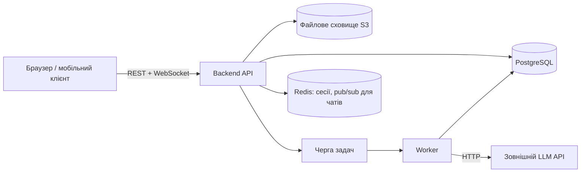
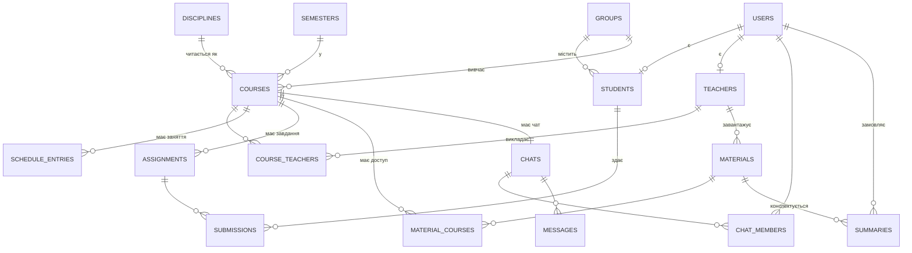
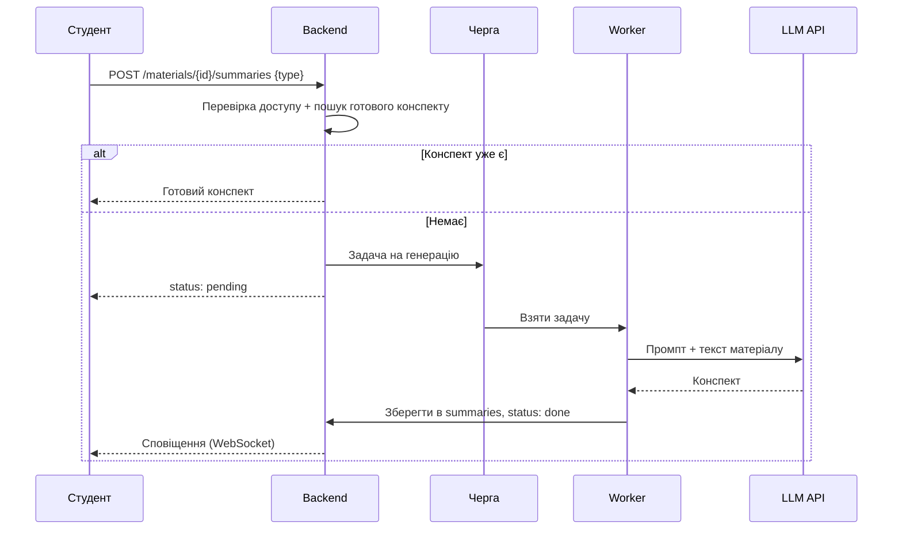

# Віртуальне навчальне середовище (ВНС)

> Концептуальний опис системи: ролі, модулі, структура бази даних, API та AI-агент для складання конспектів.

---

## 1. Загальна ідея

ВНС — вебплатформа для взаємодії студентів і викладачів у межах навчального закладу. Система об'єднує в одному місці:

- **дисципліни** та їх прив'язку до груп студентів;
- **розклад** занять;
- **лабораторні роботи та дедлайни**;
- **навчальні матеріали**;
- **месенджер** (чат «група + викладач» для кожної дисципліни);
- **AI-агента**, який складає конспекти за навчальними матеріалами.

---

## 2. Ролі користувачів

| Роль | Як реєструється | Основні можливості |
|---|---|---|
| **Студент** | За номером студентського квитка | Бачить свої дисципліни, розклад, дедлайни, матеріали; пише в чати своїх груп; генерує конспекти через AI |
| **Викладач** | За номером картки викладача (службового посвідчення) | Додає матеріали, створює лабораторні та дедлайни, редагує розклад своїх занять, веде чати з групами |
| **Адміністратор** | Створюється вручну | Керує групами, дисциплінами, прив'язкою викладачів, імпортом реєстрів студентів/викладачів |

### Реєстрація

Щоб зареєструватись міг лише реальний студент чи викладач, адміністратор заздалегідь імпортує **реєстр** (наприклад, CSV із деканату): номер квитка/картки, ПІБ, група (для студентів), кафедра (для викладачів).

Процес реєстрації:

1. Користувач вводить номер студентського квитка / картки викладача.
2. Система перевіряє номер у реєстрі і що він ще не зайнятий.
3. Користувач вказує email і пароль, підтверджує email.
4. Акаунт автоматично отримує роль і прив'язку до групи/кафедри з реєстру.

---

## 3. Функціональні модулі

### 3.1 Дисципліни
- Дисципліна належить до навчального плану і прив'язується до однієї або кількох груп.
- Кожен зв'язок «дисципліна + група» має свого викладача (або кількох: лектор, практик).
- Студент бачить лише **актуальні** дисципліни — ті, що прив'язані до його групи в поточному семестрі.

### 3.2 Розклад
- Заняття = дисципліна + група + викладач + час + аудиторія/посилання + тип (лекція, практика, лаба).
- Підтримка повторюваних занять (щотижня, чисельник/знаменник).
- Викладач може змінити або скасувати конкретне заняття; студенти отримують сповіщення.

### 3.3 Лабораторні та дедлайни
- Викладач створює завдання: назва, опис, файли, дедлайн, максимальний бал.
- Студент бачить список дедлайнів, відсортований за датою, з позначками «скоро», «прострочено», «здано».
- (Опційно) студент завантажує виконану роботу, викладач ставить оцінку/коментар.

### 3.4 Навчальні матеріали
- Викладач завантажує файли (PDF, DOCX, PPTX, відео-посилання) або текстові сторінки.
- Матеріали групуються за темами/тижнями в межах дисципліни.
- Матеріали доступні всім групам, що вивчають дисципліну в цього викладача.

### 3.5 Месенджер
- Для кожної пари **«дисципліна + група»** автоматично створюється чат, куди входять усі студенти групи та викладачі цієї дисципліни.
- Функції: текстові повідомлення, файли, згадки (@), закріплені повідомлення від викладача.
- Працює в реальному часі через WebSocket.
- (Опційно) особисті чати студент ↔ викладач.

### 3.6 AI-агент для конспектів (основна фішка)
- Студент обирає матеріал (або кілька) і натискає «Скласти конспект».
- Бекенд витягує текст із файлу і надсилає його до зовнішнього LLM API (наприклад, Claude API) — **нічого не запускається локально на сервері**, лише HTTP-запит.
- Результат зберігається і доступний студенту повторно, без повторної генерації.
- Варіанти конспекту: короткий, детальний, питання для самоперевірки.

Детальніше — у розділі 6.

---

## 4. Архітектура



| Компонент | Призначення | Приклад технологій |
|---|---|---|
| Frontend | Інтерфейс для студентів і викладачів | React / Vue / Next.js |
| Backend API | Бізнес-логіка, авторизація, REST | Node.js (NestJS), Python (FastAPI / Django) |
| БД | Основні дані | PostgreSQL |
| Файлове сховище | Матеріали, здані роботи | S3 / MinIO |
| Redis | Кеш, сесії, pub/sub для месенджера | Redis |
| Черга + Worker | Асинхронна генерація конспектів, сповіщення | BullMQ / Celery |
| LLM API | Генерація конспектів | Claude API або інший провайдер |

---

## 5. База даних

### 5.1 Основні сутності

| Таблиця | Що зберігає | Ключові поля |
|---|---|---|
| `users` | Усі акаунти | id, email, password_hash, role, full_name |
| `registry` | Імпортований реєстр для перевірки при реєстрації | card_number, type (student/teacher), full_name, group_id, is_claimed |
| `students` | Профіль студента | user_id, student_card_number, group_id |
| `teachers` | Профіль викладача | user_id, teacher_card_number, department |
| `groups` | Академічні групи | id, name (напр. «КН-31»), year |
| `semesters` | Семестри | id, start_date, end_date, is_current |
| `disciplines` | Дисципліни | id, name, description, credits |
| `courses` | **Дисципліна у конкретній групі в конкретному семестрі** | id, discipline_id, group_id, semester_id |
| `course_teachers` | Хто викладає курс | course_id, teacher_id, role (лектор/практик) |
| `schedule_entries` | Заняття в розкладі | id, course_id, teacher_id, weekday / date, start_time, end_time, room, type, recurrence |
| `schedule_changes` | Зміни/скасування окремих занять | schedule_entry_id, date, new_time, is_cancelled |
| `materials` | Навчальні матеріали | id, discipline_id, teacher_id, title, topic, file_url, extracted_text |
| `material_courses` | Для яких курсів доступний матеріал | material_id, course_id |
| `assignments` | Лабораторні/завдання | id, course_id, title, description, deadline, max_score |
| `submissions` | Здані роботи | id, assignment_id, student_id, file_url, submitted_at, score, feedback |
| `chats` | Чати | id, course_id (для групових), type (group/direct) |
| `chat_members` | Учасники чату | chat_id, user_id, last_read_at |
| `messages` | Повідомлення | id, chat_id, sender_id, text, attachment_url, created_at |
| `summaries` | Згенеровані конспекти | id, material_id, user_id, type, content, status, created_at |
| `notifications` | Сповіщення | id, user_id, type, payload, is_read |

### 5.2 Зв'язки



### 5.3 Ключова ідея: сутність `courses`

`courses` — центральний вузол системи: «дисципліна X для групи Y у семестрі Z». До неї прив'язані розклад, завдання, матеріали і чат. Завдяки цьому:

- **Актуальні дисципліни студента** = `courses` де `group_id` = група студента і `semester.is_current = true`.
- **Чат** створюється автоматично при створенні `course`; учасники — всі студенти групи + викладачі з `course_teachers`.
- **Права викладача** перевіряються просто: чи є він у `course_teachers` для цього курсу.

### 5.4 Автоматичні дії

- Новий студент у групі → додається до всіх чатів курсів своєї групи.
- Новий викладач у курсі → додається до чату курсу.
- Новий матеріал → з файлу витягується текст (`extracted_text`) для AI-агента.
- Зміна розкладу / нове завдання / наближення дедлайну (за 24 год) → запис у `notifications` + push/email.

---

## 6. AI-агент для конспектів

### 6.1 Потік роботи



### 6.2 Принципи

- **Зовнішній API, не локальна модель** — сервер лише робить HTTP-запити, тож не потрібна GPU. API-ключ зберігається тільки на бекенді, клієнт до нього доступу не має.
- **Асинхронність** — генерація займає секунди–хвилини, тож виконується у worker'і через чергу, щоб не блокувати API.
- **Кешування** — конспект одного типу для одного матеріалу генерується один раз і перевикористовується для всіх студентів (якщо матеріал не змінився).
- **Великі матеріали** — якщо текст задовгий, він ділиться на частини: спершу конспектується кожна частина, потім робиться загальний конспект.
- **Ліміти** — обмеження кількості генерацій на студента за добу, щоб контролювати витрати на API.

### 6.3 Приклад промпту

```
Ти — помічник студента. На основі навчального матеріалу нижче склади
структурований конспект українською мовою: основні поняття, визначення,
формули, ключові висновки. Не додавай інформацію, якої немає в матеріалі.

Тип конспекту: {короткий | детальний | питання для самоперевірки}
Дисципліна: {назва}

Матеріал:
{extracted_text}
```

---

## 7. API (загальний огляд)

REST API з JWT-авторизацією. Кожен запит перевіряє роль і доступ до конкретного курсу.

| Група | Ендпоінти | Хто може |
|---|---|---|
| **Auth** | `POST /auth/register`, `POST /auth/login`, `POST /auth/refresh` | Усі |
| **Профіль** | `GET /me`, `GET /me/courses`, `GET /me/schedule?from=&to=`, `GET /me/deadlines` | Усі авторизовані |
| **Курси** | `GET /courses/{id}` | Учасники курсу |
| **Розклад** | `POST /courses/{id}/schedule`, `PATCH /schedule/{id}`, `POST /schedule/{id}/changes` | Викладач курсу |
| **Матеріали** | `GET /courses/{id}/materials`, `POST /materials`, `PATCH/DELETE /materials/{id}` | Читати — учасники, змінювати — викладач |
| **Завдання** | `GET /courses/{id}/assignments`, `POST /courses/{id}/assignments`, `PATCH /assignments/{id}` | Читати — учасники, змінювати — викладач |
| **Здачі** | `POST /assignments/{id}/submissions`, `PATCH /submissions/{id}` (оцінка) | Здати — студент, оцінити — викладач |
| **Чати** | `GET /chats`, `GET /chats/{id}/messages?before=`, WebSocket `/ws` | Учасники чату |
| **AI** | `POST /materials/{id}/summaries`, `GET /summaries/{id}`, `GET /me/summaries` | Студенти курсу |
| **Адмін** | `POST /admin/registry/import`, CRUD груп, дисциплін, курсів | Адміністратор |

### Месенджер через WebSocket

- Клієнт підключається до `/ws` з JWT-токеном.
- Події: `message:new`, `message:read`, `typing`, `notification`, `summary:ready`.
- Повідомлення спершу зберігається в БД, потім розсилається учасникам через Redis pub/sub (щоб працювало з кількома інстансами бекенду).

---

## 8. Безпека

- Паролі — хешування (bcrypt/argon2).
- JWT з коротким терміном дії + refresh-токени.
- Перевірка доступу на рівні курсу: студент бачить лише курси своєї групи, викладач редагує лише свої.
- Файли віддаються через тимчасові підписані посилання.
- API-ключ LLM — лише в змінних середовища бекенду.
- Rate limiting для логіну та AI-запитів.

---

## 9. Можливі розширення

- Журнал оцінок і рейтинг студентів.
- Тести/квізи, які AI генерує за матеріалами.
- Інтеграція з Google Calendar (експорт розкладу).
- Мобільний застосунок із push-сповіщеннями.
- AI-чат «запитай по матеріалу» (питання-відповідь по конкретній лекції).
