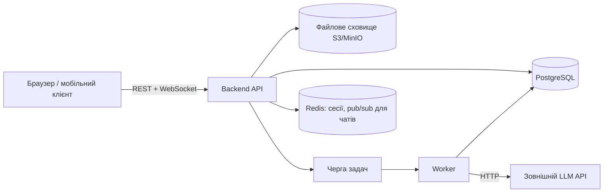
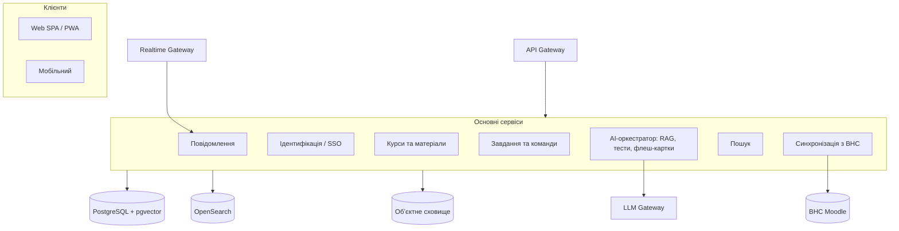
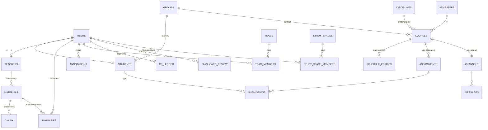

# Ідея проєкту: власна навчальна платформа (альтернатива ВНС Львівської політехніки)

> **Статус:** чернетка v0.2 — об'єднання ідей команди перед фінальним узгодженням
> **Джерела:** `drafts/MVP_Vova.md`, `drafts/VNS_LPNU_business_report.md`, `drafts/orbit-learning-platform-spec.uk.md`, `drafts/virtual-learning-environment.md`
> **Мета документа:** звести чотири окремі напрацювання в один узгоджений опис ідеї проєкту для навчального завдання з бізнес-аналізу (стейкхолдери, вимоги, UML). Розділ 15 містить пункти, які команда має явно погодити на міті — решта тексту вже є спробою об'єднання без втрати ідей жодного з чотирьох файлів.
>
> **Рішення команди (2026-09-22):** бекенд буде **власним, кастомним** — без інтеграції/синхронізації з Moodle-ВНС (тобто підхід «B» з розділу 4). Розділи про архітектуру, синхронізацію з ВНС і діаграми (7, 8) наразі лишені **як зібраний довідковий матеріал** — вони показують, який обсяг функціоналу й моделі даних команда вже продумала, а не остаточний план реалізації: фактичну архітектуру команда все одно робитиме по-своєму.

---

## 1. Контекст і проблема

Віртуальне навчальне середовище (ВНС, `vns.lpnu.ua`) Львівської політехніки — це Moodle-подібна LMS, яка добре виконує роль **сховища контенту**: лекції, PDF, завдання, оцінки, календар. Аудит студентського кабінету (2 курс, вересень 2026) показує конкретні проблеми:

- **Немає живої комунікації всередині курсу.** У власному кабінеті — 0 групових і 0 приватних бесід, попри 500+ користувачів онлайн; студенти йдуть у Telegram/Discord, і обговорення губляться поза системою.
- **Немає інструментів для командної роботи** — групові проєкти йдуть повз LMS, внесок учасників не видно викладачу.
- **Матеріали лекцій статичні** (текст/PDF) — без конспектів, самоперевірки, пошуку.
- **Оманливий підсумок оцінок**: Moodle рахує середнє лише за вже оціненими елементами (наприклад, «10/10 = 100 %», хоча реально зароблено 10 зі 100 можливих балів курсу) — студент не бачить справжнього стану.
- **Календар практично порожній**, немає імпорту з зовнішніх календарів.
- Застарілий, перевантажений, desktop-first інтерфейс, слабкий мобільний досвід.
- Немає аналітики для викладача (хто відстає, хто не заходив).

Водночас платформа має що зберегти: структуру курсу за темами, зважений журнал оцінок, увімкнені мобільні вебсервіси (REST API вже доступне), інституційний SSO (`@lpnu.ua`).

**Навчальна рамка проєкту:** це демонстраційний (не для реального впровадження) бізнес-кейс для відпрацювання навичок бізнес-аналізу — стейкхолдери, вимоги, UML (use case, activity, за потреби class/sequence), опис бізнес-цінності.

---

## 2. Бачення продукту

> *Кожен студент університету має одне місце, щоб розуміти матеріал, працювати з одногрупниками й завжди знати, що робити далі.*

Продукт — **власна платформа з кастомним бекендом** (не інтеграція з Moodle-ВНС): курси, групи, розклад, дедлайни й оцінки ведуться у власній моделі даних, а зверху додається те, чого немає в поточній ВНС: жива комунікація, командна робота, AI-допомога в навчанні, єдиний пошук, нотатки, гейміфікація мотивації та реальне планування часу.

**Ключовий принцип:** ідеї «що показує / чого бракує ВНС» (розділ 1) лишаються джерелом вимог і надихають функціонал, але дані й архітектура — свої, без синхронізації з Moodle. Це рішення команда вже ухвалила (2026-09-22): деталі — у розділі 4.

**Робоча назва — «Orbit»** (запропонована в найдетальнішій специфікації команди). Потребує підтвердження — див. [Розділ 15](#15-відкриті-питання--рішення-команди).

---

## 3. Стейкхолдери

| Стейкхолдер | Роль / інтерес у проєкті |
|---|---|
| Студенти | Основні користувачі: зручний інтерфейс, швидкий доступ до матеріалів, допомога з навчанням (конспекти, пояснення, тести) |
| Викладачі | Завантажують матеріали, ставлять завдання, перевіряють роботи; зацікавлені в аналітиці активності групи й меншому навантаженні від повторюваних запитань |
| Деканати / навчальний відділ | Контролюють успішність, потребують звітності й статистики по курсах і студентах |
| ІТ-відділ / Центр дистанційного навчання (ЦДН) | Адмініструють ВНС, відповідають за стабільність, безпеку та можливі інтеграції зовнішніх сервісів |
| Методичний відділ | Формує вимоги до структури курсів і навчальних матеріалів |
| Абітурієнти / нові студенти | Потребують простого онбордингу під час першого входу |
| Лідери проєктних команд / студентських ініціатив | Потребують інструментів для розподілу роботи й відстеження внеску учасників |

### Персони (деталізація для UML і сценаріїв)

| Персона | Цілі | Що дратує зараз | Ключові функції продукту |
|---|---|---|---|
| **Студент** (2 курс) | Вчасно здавати лаби, розуміти теорію, ефективно працювати в команді | Розпорошені чати, незрозумілий стан оцінок, статичні PDF | Планувальник, AI-конспекти/флеш-картки, навчальні простори, пошук |
| **Лідер команди / Study Space** | Розподіляти роботу, стежити за прогресом групи, здати один раз за всіх | Координація в Telegram, невидимий внесок учасників | Командні проєкти, дошка задач, звіт про внесок |
| **Викладач** | Подати матеріал, відповісти на питання один раз, справедливо оцінити | Повторювані питання, немає уявлення про динаміку групи | Прив'язані нотатки, AI-FAQ, аналітика активності |
| **Асистент викладача** | Модерувати обговорення, підтримувати лабораторні | Немає інструментів модерації | Ролі модератора, черга модерації |
| **Адміністратор ВНС / кафедри** | Впровадження, відповідність вимогам, контроль витрат | Немає даних про залученість | Адмін-консоль, керування доступами й AI-квотами, журнали аудиту |

---

## 4. Ключове рішення стратегії: розширення ВНС чи власна платформа

У команди були **дві різні технічні філософії**:

| | A. Розширення поверх ВНС (підхід специфікації «Orbit») | **B. Окрема платформа з нуля** ✅ обрано |
|---|---|---|
| Дані про курси/групи/оцінки | Синхронізуються з Moodle через REST API / LTI, ВНС лишається джерелом правди | Власна модель — дисципліни, групи, семестри створюються й підтримуються самостійно, реєстрація через імпортований реєстр студентів/викладачів |
| Час до першого результату | Швидше: не треба відтворювати весь навчальний план вручну | Повільніше: потрібен адмін-імпорт реєстру, ручне налаштування дисциплін і груп |
| Залежність від університету | Потрібен дозвіл ІТ-служби на доступ до API (або пілот через студентський токен) | Незалежна від Moodle, але дублює дані, які вже є у ВНС |
| Відповідність навчальному кейсу «переробка ВНС» | Пряме влучення в тему бізнес-звіту | Більше схоже на новий продукт «для спільного навчання» (ближче до ідеї Study Spaces) |

**Рішення (2026-09-22):** команда обирає **підхід B — власний кастомний бекенд**, без інтеграції чи синхронізації з Moodle. Причина: реалізація все одно піде іншим шляхом, ніж описано в підході A, тож немає сенсу закладатись на синхронізацію з ВНС.

Практичні наслідки цього рішення для решти документа:

- Реєстрація через реєстр деканату (розділ 5.2) стає **єдиним і основним** способом входу; режими інтеграції з ВНС (токен/LTI) переносяться в розділ 7.4 як довідкова інформація.
- Розділи 7 і 8 (архітектура, синхронізація з ВНС, модель даних) лишаються в документі **як зібрана довідкова інформація** — вони фіксують, який обсяг сутностей і функціоналу вже продуманий командою, а не остаточний план реалізації. Свою архітектуру команда розробить окремо, коли дійде до цього кроку.
- Ідеї Study Spaces, комунікаційного хабу, AI-помічника, гейміфікації тощо (розділ 6) не залежать від того, звідки беруться дані про курси/групи, тож лишаються без змін.

---

## 5. Ролі, реєстрація та автентифікація

### 5.1 Ролі

| Роль | Основні можливості |
|---|---|
| **Студент** | Бачить свої актуальні дисципліни, розклад, дедлайни, матеріали; спілкується в каналах/навчальних просторах своїх груп; користується AI-помічником |
| **Викладач** | Додає матеріали, створює завдання й дедлайни, редагує розклад своїх занять, веде канали з групами, бачить аналітику активності |
| **Адміністратор** | Керує курсами й доступами, інтеграціями, AI-квотами, переглядає журнали аудиту, модерує контент |

### 5.2 Реєстрація та автентифікація — власна, через реєстр деканату

Оскільки бекенд кастомний і не інтегрується з Moodle (розділ 4), основним і єдиним способом реєстрації є імпортований реєстр, а не токен ВНС:

1. Адміністратор імпортує **реєстр** (CSV з деканату): номер студентського/картки викладача, ПІБ, група/кафедра.
2. Користувач вводить номер квитка/картки → система перевіряє, що він у реєстрі й ще не «зайнятий».
3. Користувач задає email і пароль, підтверджує email.
4. Акаунт автоматично отримує роль і прив'язку до групи/кафедри з реєстру.

Автентифікація далі — власні email+пароль (хешування bcrypt/argon2) + JWT з refresh-токеном (розділ 10). SSO/токен ВНС і LTI (варіанти A/B/C з попередніх чернеток) лишаються описаними в розділі 7.4 лише як довідкова інформація на випадок, якщо команда згодом вирішить усе ж інтегруватися з ВНС.

---

## 6. Функціональні модулі

### 6.1 Комунікаційний хаб і навчальні простори (Study Spaces)

**Мета:** перенести спілкування курсу *всередину* навчального контексту, щоб воно було доступне для пошуку й пов'язане з матеріалами та дедлайнами — і водночас дати місце для неформальних, самоорганізованих груп навчання (ідея Study Spaces).

**Офіційні канали курсу** (авто-створюються для пари «дисципліна + група»):

```
Простір курсу: Програмування клієнтських систем
├── 📢 #оголошення          (пише лише викладач; студенти відповідають у тредах)
├── 💬 #загальне
├── ❓ #питання-відповіді    (режим Q&A: прийняті відповіді, AI-підказки про дублікати)
├── 📚 #модуль-N             (автоматично на кожен розділ курсу з ВНС)
├── 🧪 #лаба-N               (автоматично на кожне завдання; архівується через 14 днів після дедлайну)
└── 👥 Групи / 🛠 Команди
```

**Навчальні простори (Study Spaces)** — доповнення поверх офіційних каналів, для само­організованого навчання (може бути міжгруповим):

- Користувач створює Study Space навколо теми: тег, навчальна ціль, потрібний рівень знань, максимальний розмір групи.
- Інші учасники шукають і приєднуються до існуючих просторів за темою.
- Усередині — спілкування, запитання, обмін матеріалами (PDF, текст, посилання).
- Це саме той шар, де AI-помічник (розділ 6.3) обробляє спільні матеріали й обговорення в конспекти/FAQ/тести для всіх учасників простору.

**Основні функції каналів:** реальний час (WebSocket), треди, приватні й групові повідомлення, згадки (`@user`, `@team`, `@lecturer`), markdown + код + LaTeX, картки матеріалів (посилання розгортається у картку з дедлайном), обмін файлами з версіонуванням, режим Q&A з прийнятими відповідями, оголошення з обов'язковим підтвердженням прочитання, модерація (скарги, повільний режим, роль модератора).

**Поділ на групи (для викладача):** автоматичний імпорт академічних груп; ручний або автоматичний поділ на підгрупи (випадково / за алфавітом / за вибором студентів / з балансуванням навичок).

### 6.2 Команди та групові проєкти

**Мета:** повна підтримка групових проєктів — від формування команди до єдиної фінальної здачі — зі справедливим і видимим внеском.

- **Формування команд:** самостійний вибір, коди запрошення, призначення викладачем, автоматичне доукомплектування нерозподілених до дедлайну, розподіл за темами (стабільне паросполучення).
- **Робочий простір команди:** приватний канал, спільні файли з версіонуванням, дошка задач (вбудований Kanban або прив'язана Jira/Trello/GitHub Projects), етапи (milestones), шаблон протоколу зустрічі з AI-підсумком, єдина зона здачі (записується назад у ВНС).
- **AI-розподіл роботи:** лідер команди вставляє умову завдання → AI пропонує структуру задач, графік і збалансований розподіл за навичками; лідер редагує й приймає.
- **Внесок і справедливість:** панель внеску (виконані задачі, коміти/PR, файли, відвідування зустрічей, взаємооцінювання за рубрикою), раннє попередження викладачу про неактивного учасника (ніколи публічно), метрики внеску — лише основа для розмови, не автоматична оцінка.

### 6.3 AI-помічник для навчання

**Мета:** допомогти студентам *розуміти й запам'ятовувати* матеріал, спираючись виключно на матеріали курсу/простору — без вигаданої інформації.

Об'єднана ідея з усіх трьох джерел (Vova, Orbit-специфікація, концептуальний опис):

| Можливість | Вхід | Результат |
|---|---|---|
| **Конспект** | Матеріал / модуль / курс / обговорення в Study Space | TL;DR, ключові поняття, структурований план, глосарій — короткий / детальний / у форматі питань для самоперевірки |
| **FAQ** | Спільні обговорення й запитання в просторі | Список поширених запитань з відповідями |
| **Пояснення** | Виділений текст, слайд, термін | Пояснення простою мовою з посиланням на джерело |
| **Генератор тестів** | Матеріали, складність, тип питань | Тест, з якого система оновлює рівень знань користувача за відповідями |
| **Флеш-картки** | Матеріали або виділення | Картки питання/відповідь з інтервальним повторенням |
| **AI-викладач / «Запитай курс»** | Питання природною мовою в окремому чаті | Відповідь з посиланням на джерело, з урахуванням поточного рівня знань користувача |
| **Помічник з лаб (з обмеженнями)** | Умова завдання | Роз'яснює вимоги, дає чек-лист; не пише готове рішення, якщо викладач позначив завдання як «оцінюване» |
| **Аудіоконспект** | Модуль | Короткий подкаст-підсумок (TTS) |

**Індивідуальні знання:** для кожного користувача система зберігає простий рівень знань за окремими поняттями. Початковий рівень — із самооцінки при вході в тему; після тестів рівень оновлюється на основі відповідей. AI-викладач і складність згенерованих тестів підлаштовуються під цей рівень.

**Технічний принцип (спільний для всіх джерел):** обробка йде через зовнішній LLM API (не локальна модель на сервері) — бекенд лише формує HTTP-запит; результат кешується й повторно використовується всіма учасниками курсу/простору без повторної генерації; великі матеріали розбиваються на частини перед конспектуванням; є денний ліміт запитів на користувача.

**Запобіжники доброчесності:** відповіді завжди спираються на джерела (RAG) і позначаються посиланнями; якщо впевненість пошуку низька — чесна відповідь «не знайшов цього в матеріалах курсу»; AI відмовляється писати повне рішення оцінюваної роботи; викладач керує, які AI-функції увімкнені для курсу/завдання (усі / лише конспекти / вимкнено; окремо — режим для оцінюваних робіт).

**Ідея на майбутнє (з MVP-нотатки):** граф-роадмапа тем курсу — коли «лід» групи хоче її оновити, AI збирає контекст з матеріалів і обговорень і оновлює мапу тем.

### 6.4 Уніфікований пошук

Єдиний рядок пошуку, що знаходить будь-який матеріал, завдання, повідомлення, нотатку чи подію в усіх курсах і просторах користувача:

- Гібридний пошук: ключові слова (BM25, український аналізатор) + семантичний (векторні ембедінги), об'єднані ранжуванням.
- Фільтр прав доступу застосовується *до* видачі результатів — користувач ніколи не бачить того, до чого немає доступу.
- Прямі посилання відкривають результат на точній сторінці/слайді/абзаці.
- Режим «Питання» — відповідь LLM з посиланнями замість списку результатів.

### 6.5 Нотатки та анотації

- **Типи:** спільна нотатка викладача (усім студентам курсу), особиста нотатка викладача, особиста нотатка студента, командна нотатка, публічна нотатка студента (з опційною модерацією).
- Прив'язка до конкретного місця в матеріалі (абзац HTML-сторінки, область/сторінка PDF, слайд); при оновленні матеріалу прив'язка відновлюється нечітким порівнянням тексту.
- «Перетворити на флеш-картку» для будь-якого виділення чи нотатки; студентський «зошит» з експортом (Markdown/PDF).

### 6.6 Гейміфікація

**Мета:** заохочувати стабільні навчальні звички та співпрацю, без шкоди самопочуттю.

- **XP і рівні** за змістовні дії: вчасна здача, рання здача, пройдений AI-тест, сесія повторення карток, прийнята відповідь у Q&A, схвалений внесок у бібліотеку матеріалів, взаємооцінювання. З денними лімітами й захистом від зловживань (наприклад, немає XP за кількість повідомлень).
- **Серії (streaks)** 🔥 з можливістю «заморозки» на 1 день, щоб хвороба чи сесія не ламали мотивацію.
- **Бейджі** за конкретні досягнення (наприклад, 30 днів серії, 5 схвалених внесків у бібліотеку).
- **Рейтинги — лише за бажанням**, щотижневе скидання, показ тільки топ-10 і власної позиції.
- **Магазин винагород:** косметика (теми, рамки аватара), корисності (додаткова заморозка серії), преміум-функції (більше AI-запитів, аудіоконспекти) — **ніколи не впливає на офіційні оцінки**, якщо викладач свідомо не увімкнув конкретний бонус для свого курсу.
- **Турбота про самопочуття:** пауза серії («режим відпустки»), тихі години без сповіщень, тижневий підсумок підкреслює прогрес, а не порівняння з іншими.

### 6.7 Прогрес, розклад і планування

- **Прогноз оцінок** — три числа для кожного курсу замість оманливого підсумку Moodle: *зароблено*, *результат за вже оціненими роботами*, *максимально досяжно*; плюс симулятор «що мені потрібно набрати, щоб отримати оцінку X».
- **Розклад:** заняття = дисципліна + група + викладач + час + аудиторія/посилання + тип (лекція/практика/лаба); підтримка повторюваних занять і скасувань з автоматичним сповіщенням студентів.
- **Дедлайни:** список, відсортований за датою, з позначками «скоро / прострочено / здано»; сповіщення за 72/24/3 години до дедлайну, якщо роботу ще не здано.
- **Єдиний календар:** ВНС + Google/Outlook/CalDAV/ICS в одному вигляді, з експортом персонального ICS-фіду.
- **AI-планувальник:** на основі дедлайнів з усіх курсів, зайнятості з календаря та оцінки трудомісткості задач будує розклад сесій підготовки, пояснює план людською мовою, автоматично перепланує при змінах.
- **Головна сторінка «Сьогодні»:** що робити далі, план на тиждень, черга повторення карток, стан курсів, непрочитане — одна агрегована сторінка замість розкиданого кабінету ВНС.

### 6.8 Дизайн і доступність

- Mobile-first, адаптивний інтерфейс, який можна встановити (PWA), з офлайн-доступом до завантажених матеріалів і флеш-карток.
- Ієрархія «що мені треба зробити зараз» — попереду архівів.
- Темна тема, доступність (WCAG 2.2 AA, навігація з клавіатури, шрифт для людей з дислексією), локалізація UA/EN.

---

## 7. Архітектура та технології

> **Статус розділу:** довідковий матеріал, зібраний з чернеток команди. Оскільки обрано кастомний бекенд без інтеграції з Moodle (розділ 4), фактичну архітектуру команда спроєктує окремо — цей розділ лише фіксує, які варіанти й компоненти вже обговорювались, щоб не загубити ідеї.

Пропонується **два рівні деталізації**, щоб не втратити ні прагматичний варіант «зробити для курсового проєкту», ні бачення «як це виглядало б насправді».

### 7.1 Спрощена архітектура (достатньо для навчального прототипу)



| Компонент | Призначення | Приклад технологій |
|---|---|---|
| Frontend | Інтерфейс для студентів і викладачів | React / Next.js |
| Backend API | Бізнес-логіка, авторизація, REST + WebSocket | Node.js (NestJS) або Python (FastAPI) |
| БД | Основні дані | PostgreSQL (+ `pgvector` для семантичного пошуку) |
| Файлове сховище | Матеріали, здані роботи | S3 / MinIO |
| Redis | Кеш, сесії, pub/sub для месенджера | Redis |
| Черга + Worker | Асинхронна генерація конспектів/тестів, сповіщення | BullMQ / Celery |
| LLM API | Генерація конспектів, тестів, відповідей AI-помічника | Зовнішній провайдер (наприклад, Claude API) |

### 7.2 Цільова архітектура (якщо продукт розвивати як реальний, за специфікацією Orbit)



Ключові відмінності від спрощеного варіанта: розділення на модульний моноліт з чіткими межами доменів (комунікації, AI, синхронізація), гібридний пошук (ключові слова + вектори), окремий realtime-шлюз для WebSocket, LLM Gateway з маршрутизацією моделей і кешем, спостережуваність (метрики/трейси/логи), Kubernetes для розгортання. Це рівень «якщо продукт піде далі навчального завдання» — не обов'язково реалізовувати повністю для курсового проєкту.

### 7.3 Синхронізація з ВНС (якщо обрано підхід A з розділу 4)

| Сутність | Частота синхронізації |
|---|---|
| Курси, на які записаний | При вході, далі кожні 6 год |
| Вміст курсу | Кожні 30 хв; за запитом при відкритті |
| Завдання та статус подання | Кожні 15 хв; кожні 5 хв за 48 год до дедлайну |
| Оцінки | Кожні 30 хв |
| Події календаря | Кожні 30 хв (вікно −7…+120 днів) |

Відповідність понять: курс Moodle → простір курсу; розділ → модуль; `mod_assign` → завдання (індивідуальне або командне); групи Moodle → групи/команди; журнал оцінок → елементи оцінювання + прогноз.

### 7.4 Режими автентифікації з ВНС (довідково, наразі не обрано)

Ці режими стосуються підходу A (розширення ВНС), від якого команда відмовилась на користь власного бекенду (розділ 4). Лишено для довідки, якщо рішення переглянуть:

| Режим | Як | Коли використовувати |
|---|---|---|
| **A. Особистий токен (пілот)** | Студент входить обліковими даними ВНС; продукт отримує токен через `/login/token.php?service=moodle_mobile_app` — той самий механізм, що й офіційний мобільний застосунок Moodle | Пілот з ініціативи студентів, 1–2 курси; пароль ВНС ніколи не зберігається — лише токен |
| **B. Інституційний вебсервіс** | Університет реєструє окремий зовнішній сервіс із сервісним обліковим записом | Офіційне впровадження на рівні кафедри |
| **C. LTI 1.3 Advantage** | Продукт реєструється як LTI-інструмент (deep linking, Names & Roles, Assignment & Grade Services) | Глибоке вбудовування в курси Moodle, передача оцінок назад |

---

## 8. Модель даних (ключові сутності)



Основні таблиці (об'єднано з обох специфікацій): `users`, `registry` (для реєстрації через реєстр — розділ 5.2), `students`, `teachers`, `groups`, `semesters`, `disciplines`, `courses` (дисципліна + група + семестр — центральний вузол системи), `course_teachers`, `schedule_entries`, `schedule_changes`, `materials`, `chunk` (фрагменти для пошуку/AI з ембедінгами), `assignments`, `submissions`, `channels`, `messages`, `annotations`, `summaries`, `study_spaces`, `study_space_members`, `teams`, `team_members`, `xp_ledger`, `flashcard`/`flashcard_review`, `notifications`.

`courses` лишається ключовою сутністю: «дисципліна X для групи Y в семестрі Z» — до неї прив'язані розклад, завдання, матеріали й канал; канал курсу створюється автоматично з усіма студентами групи й викладачами.

---

## 9. API — огляд

REST (OpenAPI 3.1) + WebSocket для реального часу, JWT-авторизація, кожен запит перевіряє роль і доступ до конкретного курсу.

| Група | Приклади ендпоінтів | Хто може |
|---|---|---|
| Auth | `POST /auth/register`, `POST /auth/login` | Усі |
| Профіль | `GET /me/today`, `GET /me/schedule`, `GET /me/deadlines` | Усі авторизовані |
| Матеріали | `GET /courses/{id}/materials`, `POST /materials` | Читати — учасники, змінювати — викладач |
| Завдання / здачі | `POST /assignments/{id}/submissions` | Здати — студент, оцінити — викладач |
| Канали / Study Spaces | `GET /channels/{id}/messages`, WebSocket `/ws` | Учасники |
| AI | `POST /materials/{id}/ai/summary`, `POST /ai/quizzes` | Студенти курсу/простору |
| Пошук | `POST /search` (`mode: search \| ask`) | Усі авторизовані, з фільтром доступу |
| Оцінки | `GET /spaces/{id}/grades/forecast` | Студент курсу |
| Адмін | `POST /admin/registry/import`, CRUD курсів/груп | Адміністратор |

---

## 10. Безпека, приватність, академічна доброчесність

- Паролі — хешування (bcrypt/argon2); JWT з коротким терміном дії + refresh-токени.
- **Пароль ВНС ніколи не зберігається** — лише токен (за потреби, зашифрований).
- Перевірка доступу на рівні курсу: студент бачить лише курси своєї групи, викладач редагує лише свої; фільтрація прав доступу в пошуку й AI відбувається *до* генерації відповіді — LLM ніколи не бачить фрагментів без доступу.
- Файли — через тимчасові підписані посилання, антивірусна перевірка, ліміти розміру й типу.
- API-ключ LLM — лише в змінних середовища бекенду, rate limiting для логіну й AI-запитів.
- Відповідність Закону України «Про захист персональних даних» і принципам GDPR; налаштування студента: експорт даних, видалення акаунта, вимкнення аналітики й рейтингів.
- Академічна доброчесність: політику AI для кожного оцінювання визначає викладач; AI-контент завжди позначений; AI відмовляється писати готові рішення оцінюваних робіт.

---

## 11. Дорожня карта та обсяг MVP

Для навчального проєкту важливіше **чітко окреслити мінімальний обсяг**, ніж повторювати повну дорожню карту «реального продукту». Пропоноване ядро MVP (об'єднання найпростішої ідеї Vova з пріоритетами повної специфікації):

1. Реєстрація/вхід через реєстр деканату (розділ 5.2).
2. Курс/простір → список матеріалів, дедлайнів, простий канал спілкування.
3. Study Space: створення/пошук за темою, спільні матеріали, чат.
4. AI: конспект за матеріалами простору, генерація тесту, оновлення рівня знань за результатом тесту.
5. AI-викладач: чат з відповідями на основі матеріалів простору/курсу.
6. Базовий прогноз оцінок або хоча б список дедлайнів «скоро / прострочено / здано».

Розширення (після ядра, за наявності часу): нотатки/анотації, гейміфікація (streaks, XP), команди з дошкою задач, єдиний календар, повноцінний гібридний пошук, розширена аналітика для викладача.

*(Повна дорожня карта на 4 етапи — від пілоту до впровадження на рівні закладу — залишена в `drafts/orbit-learning-platform-spec.uk.md`, розділ 12, як довідковий матеріал на випадок розвитку ідеї поза межі курсового завдання; вона описана для підходу з інтеграцією ВНС, тому терміни/етапи там потребуватимуть перегляду під власний бекенд.)*

---

## 12. Матеріал для UML-діаграм

Актори та приклади use case для діаграми варіантів використання (і, за потреби, діаграми активності для сценарію «Отримати AI-конспект» чи «Здати командний проєкт»):

| Актор | Приклади use case |
|---|---|
| Студент | Зареєструватися; увійти в систему; переглянути дедлайни; створити/приєднатися до Study Space; поділитися навчальним матеріалом; попросити AI обробити матеріали; отримати конспект/FAQ/тест; пройти тест; поставити запитання AI-викладачу; переглянути прогноз оцінок |
| Лідер команди | Сформувати команду; розподілити задачі (за допомогою AI); здати командний проєкт |
| Викладач | Завантажити матеріали курсу; створити завдання з дедлайном; переглянути аналітику активності групи; налаштувати AI-режим для завдання; перевірити роботи |
| Адміністратор | Імпортувати реєстр студентів/викладачів; керувати курсами й доступами; переглядати журнали використання AI; модерувати контент |
| AI-помічник (система) | Обробити завантажений/спільний матеріал; згенерувати конспект/FAQ/тест/флеш-картки; відповісти на запитання за матеріалами курсу; оновити рівень знань користувача за результатами тесту |

---

## 13. Ризики

| Ризик | Як зменшити |
|---|---|
| Університет не погоджує доступ до API ВНС / вважає пілотний токен-режим порушенням правил | Для навчального проєкту достатньо демонстраційного прототипу без реальної інтеграції; для реального пілоту — залучити ІТ-службу заздалегідь, розглянути LTI як стандартний шлях |
| Галюцинації AI або неправильні відповіді в тестах | Суворий RAG (відповідь лише на основі знайдених фрагментів), позначення джерел, чесна відповідь «не знайшов у матеріалах» |
| Використання AI для списування лаб | AI не генерує готові рішення оцінюваних завдань; режим лише підказок; рішення про увімкнення AI — за викладачем |
| Гейміфікація шкодить мотивації чи самопочуттю | Рейтинги лише за бажанням, заморозка серій, жодного XP за кількість повідомлень, тихі години |
| Вартість/складність інтеграції LLM, конфіденційність матеріалів | Кешування спільних результатів, ліміти на користувача, вибір провайдера без навчання моделі на даних клієнтів |

---

## 14. Метрики успіху (орієнтовно, для опису бізнес-цінності)

| Категорія | Метрика |
|---|---|
| Впровадження | Частка активних користувачів серед записаних у пілот |
| Залученість | Медіана активних днів на тиждень; частка користувачів із серією ≥ 7 днів |
| Навчання | Частка тестів/конспектів, оцінених як корисні; частка AI-відповідей з коректними посиланнями на джерело |
| Комунікація | Частка питань щодо курсу, поставлених у продукті, а не в зовнішніх чатах |
| Планування | Зміна частки вчасних здач порівняно з минулим семестром |

---

## 15. Відкриті питання — рішення команди

### Вирішено

1. ~~Розширення ВНС чи власна платформа~~ — **✅ 2026-09-22: власний кастомний бекенд, без інтеграції з Moodle** (розділ 4).
2. ~~Реєстрація~~ — **✅ 2026-09-22: через реєстр деканату** (розділ 5.2), режими інтеграції з ВНС лишені лише довідково (розділ 7.4).

### Ще потребують узгодження на міті

3. **Назва продукту** — лишаємо робочу назву «Orbit» чи обираємо іншу (наприклад, щось довкола ідеї Study Spaces)?
4. **Масштаб для курсового завдання** — чи потрібен працюючий прототип (бекенд + фронтенд + LLM-виклик), чи достатньо детального опису й UML-діаграм без коду?
5. **Технологічний стек власного бекенду** — конкретизувати вибір зі спрощеної архітектури (розділ 7.1: Node.js/NestJS чи Python/FastAPI тощо), бо це вже реально впливає на розробку.
6. **Пріоритет фіч у MVP** (розділ 11) — чи погоджуємось саме на цей мінімальний список, чи є фіча, яку команда вважає обов'язковою для демонстрації?
7. **Гейміфікація** — включати в MVP курсового проєкту чи залишити лише в описі як ідею для «Розширення»?
8. **Формат здачі бізнес-аналізу** — які саме UML-діаграми готуємо (use case обов'язково; чи додаємо activity/sequence/class) і хто за яку відповідає?

---

*Кінець об'єднаного документа. Основа для наступного узгодження з командою.*
